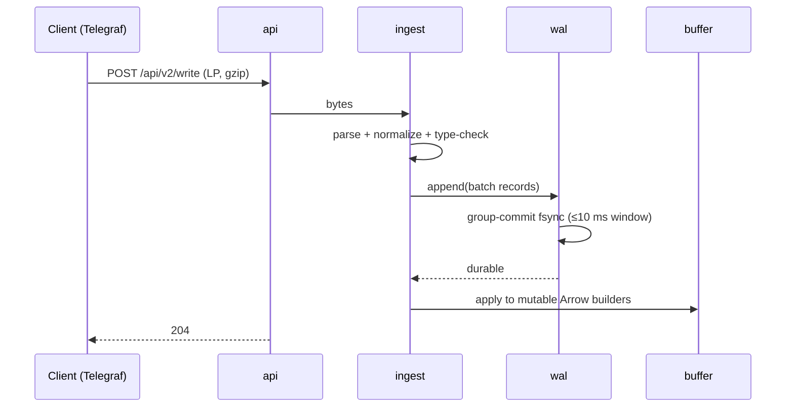
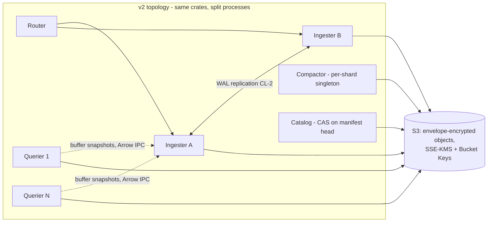

# TimelordDB — Architecture

**Status:** Draft v1 · 2026-08-08 · companion to `REQUIREMENTS.md`
(requirement IDs cited throughout; anything here that can't name its
requirement is decoration and should be challenged).

**Stack (decided, §11):** Rust · Apache DataFusion (SQL + vectorized
execution + memory pool) · Arrow (in-memory columnar, dictionary encoding)
· Parquet (immutable storage format) · `object_store` (storage
abstraction) · `arrow-flight` (Flight SQL surface) · aws-sdk-kms +
SSE-KMS/Bucket Keys for the S3 era (§12.2) · LocalStack as the
cluster test rig (§12.6).

---

## 1. System overview

One process in v1, but internally structured as the services v2 will
split apart (CL-1). Every arrow in this diagram is a Rust trait boundary.


Two invariants shape everything:

1. **RR-1:** queries execute inside an admission-controlled DataFusion
   `MemoryPool`; the process never dies from a query.
2. **CL-1:** the object store (+ manifest log inside it) is the source of
   truth; local disk holds only WAL segments and caches, both
   reconstructable. `rm -rf` the node, point a new one at the store,
   and it serves.

## 2. Requirements → architectural commitments

| Requirement | Commitment |
|---|---|
| FR-2 no series index | Tags are Arrow dictionary columns end-to-end; no structure grows with distinct-tag-combination count |
| RR-1 no query kills | One shared `MemoryPool` (default 20% RAM, configurable) + admission queue + spill-capable operators |
| SEC-1 encryption | Single `Store` trait wraps *all* object reads/writes; encryption IS a `Store` decorator (shipped — §11) |
| SEC-2 visibility labels | Exactly one mandatory-predicate injection hook, called for every table scan (shipped — §11) |
| CL-1 cluster-ready | `Catalog`, `Wal`, `Store` are traits; no component assumes sole ownership except via catalog commits |
| FR-7 per-table retention | Files never mix tables; partition time-spans align to retention granularity |
| PR-6 fresh-data penalty | Aggressive minutes-scale L0 compaction (the lever InfluxDB 3 Core lacks — its 26× gap is our headroom) |

## 3. Crate workspace

```
timelord/
  crates/
    server/      binary: wiring, config, lifecycle, /metrics
    api/         HTTP: /write, /api/v2/write, /api/v3/write_lp,
                 /health, /ping  (FR-1, FR-9 contract tests live here)
    ingest/      LP parser (zero-copy), schema normalization, type checks
    wal/         segmented WAL, fsync batching, replay, segment upload
    buffer/      mutable Arrow builders per (table, partition); snapshots
    store/       the Store trait + object_store impl  ← SEC-1 chokepoint
    catalog/     Catalog trait; manifest-log impl; local cache  ← CL-1 seam
    query/       DataFusion session factory, TableProvider,
                 memory pool + admission, predicate hook ← SEC-2, RR-1/2
    flight/      Flight SQL server (FR-8)
    compact/     L0→L1→L2 planner + executor (PR-6)
    retention/   per-table policy enforcement (FR-7)
    discovery/   Discovery trait; static backend (v1), Consul (v2)  ← CL-5
  tests/
    at/          AT-1..AT-6 harness glue (tsdb-bench adapter lives in
                 bench/backends/timelorddb.py, not here)
```

Consolidating crates later is cheap; splitting a tangle is not. Start
split where trait seams matter (`store`, `catalog`, `query`), merged
elsewhere if friction appears.

## 4. Data model

Line protocol maps to per-table Arrow schemas, created on first write
(schema-on-write, additive evolution only):

- **tags** → `Dictionary<Int32, Utf8>` columns (FR-2). At reference
  workload, `product_id`'s 2M values/day cost a dictionary, not an index.
- **fields** → typed columns (`Float64`, `Int64`, `Utf8`, `Boolean`);
  first writer wins the type, conflicts rejected with line context (FR-9).
- **time** → `Timestamp(Nanosecond)`; future timestamps are ordinary data
  (FR-4).
- **Primary key** = (time, all tags). Duplicate PK ⇒ last-write-wins,
  enforced by sort+dedup at flush and by merge at query/compaction
  (FR-5) — the IOx-proven approach.

## 5. Write path



- **Ack contract:** 204 means WAL-durable on local disk (v1). CL-2 (v2)
  upgrades this to replicated-or-uploaded without changing the API.
- **Flush:** a (table, partition) buffer flushes to Parquet when it hits
  size (default 128 MB) or age (default 5 min). Flush = write via `store`
  → catalog commit → WAL segments referenced by no buffer are dropped.
- **RR-3 (≤30 s to writable after crash):** recovery replays WAL into
  buffers *before* opening any Parquet. Bound WAL replay by capping
  un-flushed WAL at ~2 GB; replay is sequential Arrow building, ≥100 MB/s
  — worst case well inside budget. Catalog opens lazily after writes are
  accepted (1.8's minutes-long TSM reopen before writability is the
  anti-pattern).
- **Backpressure:** if buffers exceed their memory budget (§10), writes
  get 429 + Retry-After rather than unbounded memory growth (RR-5:
  visible, named limit).
- **PR-1/PR-2 (flat 75K lines/s):** parser is zero-copy over the request
  body; dictionary interning per batch; nothing on the hot path scales
  with historical distinct-key count — decay is structurally impossible,
  which is the lesson of the 2.x curve.

## 6. Storage layout & catalog

Object-store layout (all access through `store`):

```
/<db>/<table>/data/<partition>/<gen>-<uuid>.parquet
/<db>/<table>/wal/<segment>.wal          (uploaded segments, CL-1)
/catalog/manifest/<seq>-<uuid>.json      (append-only manifest log)
/catalog/checkpoint/<seq>.json           (periodic full snapshot)
```

- **Partition** = (table, UTC hour). Hour granularity aligns with FR-7
  retention (per-table, file-granular drops) and bounds file counts:
  reference workload ≈ 24–48 active partitions per table.
- **Catalog = manifest log in the object store** (Iceberg-style, decided
  over embedded-DB-as-truth): each commit (flush, compaction, retention
  drop, schema add) appends a manifest entry; checkpoints bound replay.
  v1 is single-writer so commits are trivially safe; CL-2/3 upgrade to
  conditional-put CAS on the manifest head — a catalog-impl change, not
  an engine change. A local embedded cache (redb) accelerates lookups and
  is disposable (CL-1).
- **Retention (FR-7):** enforcer walks per-table policies, drops whole
  partitions past their window via catalog commit; physical deletion is
  async garbage collection (and later, SEC-1 crypto-shredding).

## 7. Compaction (PR-6 is won or lost here)

| Level | Contents | Target size | Trigger |
|---|---|---|---|
| L0 | raw flushes (~minutes of data) | 16–128 MB | every flush |
| L1 | one (table, hour) merged + deduped | ≤ 1 GB | ≥ 4 L0 files in a partition, or partition age > 10 min |
| L2 | one (table, day), sorted by (time, entity) | ≤ 8 GB split | daily roll-up of settled hours |

- Merge = k-way sorted merge on PK with last-write-wins dedup (FR-5),
  streaming, under the same memory pool as queries (a compaction cannot
  kill the server either — RR-1 applies to internal work).
- **The design bet on PR-6:** InfluxDB 3 Core's 26× fresh-vs-settled gap
  exists because Core ships no compactor. Aggressive L0→L1 (minutes, not
  hours) keeps the per-query file count low enough that "fresh" ≈ "one
  hour of small files + settled rest," targeting the ≤10× budget.
- Compaction rewrites are also where SEC-1 key rotation and future
  re-sorting/re-clustering ride for free.

## 8. Read path

```
Flight SQL (flight) 
  → session {authorizations, limits}          (SEC-2 context)
  → SQL parse/plan (DataFusion)
  → for every table scan:
       mandatory_predicate(session, table, schema)  ← the ONE injection point
       (shipped: _visibility label filter, applied in-scan to every
        batch; later variants: retention boundary, tenant scoping)
  → TableProvider = union of:
       a) buffer snapshot (zero-copy Arrow, immutable view)
       b) Parquet files from catalog, pruned by:
            partition time-range → row-group stats → bloom filters
  → dedup merge across overlapping files (PK last-write-wins)
  → execution under MemoryPool + admission queue     (RR-1)
  → stream results; client disconnect aborts plan ≤5 s   (RR-2)
```

- **RR-1 mechanics:** one pool, default 20% of RAM; per-query
  reservation cap (default pool/4); admission queue when the pool is
  contended; spill enabled for sort/aggregate/join. Rejection is a named,
  documented error (RR-5) — the graceful behavior we measured, made
  default.
- **RR-2:** every query runs under a cancellation token tied to the
  Flight stream; drop = abort. The 2.x pattern (abandoned queries
  grinding server-side toward the 1.x kill) is structurally closed.
- **PR-9 (reads during writes):** buffer snapshots are immutable Arrow
  views — readers never lock writers.
- **Distinct-count funnels (PR-4/5):** exact `COUNT(DISTINCT)` via
  DataFusion, executed on dictionary *keys* where the optimizer allows —
  distinct over Int32 keys, not strings. Approximate sketches (HLL) are
  explicitly out unless a future requirement asks.

## 9. Shape A plan (PR-3: ≤250 ms, stretch ≤50 ms)

Three rungs, cheapest first; the harness decides how far to climb:

1. **Baseline pruning (build always):** Parquet row-group stats + bloom
   filters on `product_id` per row group. Expected to beat InfluxDB 3's
   607 ms (its pruning, plus our smaller settled file count).
2. **Bounded recent-entity locator (the §13 experiment):** an evictable
   map `entity → {partition, row-groups}` for the hot window (default
   48 h), built at flush/compaction from bloom digests. Hard memory cap
   (default 256 MB), LRU eviction, rebuildable from files — *bounded and
   disposable*, therefore not AR-1's forbidden index. This chases 1.8's
   18 ms proof without inheriting its 11 GB/OOM economics.
3. **If still short:** L2 re-cluster by (entity bucket, time) to localize
   journeys physically. Only if the harness says rungs 1–2 miss.

## 10. Memory budget (reference box: 16 GB — RR-1/RR-4)

| Component | Budget (default) | Enforcement |
|---|---|---|
| Query/compaction pool | 3.2 GB (20%) | DataFusion MemoryPool, spill, admission |
| Write buffers (all tables) | 2 GB | flush pressure, then 429 backpressure |
| WAL un-flushed cap | 2 GB on disk | backpressure (bounds RR-3 replay) |
| Parquet metadata + bloom cache | 512 MB | LRU |
| Recent-entity locator (§9) | 256 MB | LRU, evictable to zero |
| Dictionaries in-flight, misc | ~1 GB | bounded by batch lifecycle |
| **Idle steady state** | **≤ 6 GB (RR-4)** | budgets above are caps, not reservations |

## 11. Security hooks (SEC — SEC-1/SEC-2/SEC-3 shipped)

- **`Store` chokepoint (SEC-1 — SHIPPED):** encryption is
  `EncryptingStore(inner, kms)` — a decorator on the one object-I/O
  trait; the engine cannot tell. Every object (Parquet, manifest,
  checkpoint) gets a fresh AES-256-GCM data key, wrapped by the KMS
  (v1: a local KEK from `TIMELORD_ENCRYPTION_KEY[_FILE]`; the `Kms`
  trait is where per-table scoping and real KMS backends arrive).
  Objects are encrypted in 64 KiB chunks, one auth tag each, with the
  header and object path as AAD — chunks cannot be reordered, spliced
  across objects, or truncated undetected. Chunking exists because the
  read path is range reads: a bloom probe decrypts a few KB, not the
  file. *Decision vs the original sketch:* whole-object envelope at the
  chokepoint was chosen over Parquet Modular Encryption (§16 risk 2) —
  it covers manifests too and owes nothing to arrow-rs PME maturity.
  PME per-column keys remain the evolution, at this same seam.
  Plaintext objects written before a key was configured stay readable;
  the local WAL is out of scope (it holds minutes of data and dies with
  the node; CL-2 WAL uploads will pass through the same store).
- **Predicate hook (SEC-2 — SHIPPED):** `fn mandatory_predicate(session,
  table, schema) -> Option<Restriction>` — called unconditionally by the
  TableProvider inside `scan()`, applied to every batch (buffer and
  file) below any user predicate and *before* aggregation; a COUNT(*)
  that never touches the label column still reads it and still cannot
  count a hidden row. v1 restriction: Accumulo-style row visibility —
  a `_visibility` dictionary tag holds expressions like
  `(ops&audit)|admin`, evaluated per distinct label against the
  session's authorizations (HTTP `X-Timelord-Authorizations` /
  Flight SQL metadata). Unlabeled rows are public; malformed labels are
  visible to no one (fail closed). Retention boundaries and tenant
  scoping arrive as further `Restriction` variants through this same
  hook. Note: until token auth lands (§12), authorizations are claims,
  not credentials — SECURITY.md is explicit about this.
  Observability: `timelord_visibility_rows_filtered_total`,
  `timelord_encryption_enabled`.
- **TLS 1.3 everywhere, built for daily cert rotation (SEC-3):** one
  rustls `ServerConfig` shared by the HTTP stack (axum/hyper) and Flight
  SQL (tonic), TLS 1.3 with a configurable 1.2 floor. Rotation mechanics:
  the server installs a custom `ResolvesServerCert` holding an
  `ArcSwap<CertifiedKey>`; a file watcher (notify crate, debounced) plus
  an admin endpoint trigger reloads. A reload parses and validates the
  new pair (expiry, key↔cert match) *before* an atomic pointer swap —
  a bad renewal is rejected, the last-good pair keeps serving, and a
  named alarm + `tls_cert_expiry_seconds` metric fire (RR-5). Because
  rustls consults the resolver only at handshake, established
  connections and in-flight Flight streams are structurally unaffected
  by rotation — no draining logic exists to get wrong. v2 mTLS puts the
  client-cert verifier's `RootCertStore` behind the same ArcSwap with
  dual-CA overlap for independent client/server rolls. Pure-Rust rustls
  keeps OpenSSL out of the build. AT-6 exercises Telegraf/Grafana over
  TLS; AT-7 is the rotation-under-load drill.

## 12. Clustering v2 on S3 (CL-1..CL-5 + SEC-1 on AWS) — design

**Status: designed 2026-08-09; build phased C0–C3 (§14).** Every seam
this composes from is already shipped: the `Store` chokepoint with
`EncryptingStore` and the `Kms` trait (SEC-1), the sequence-keyed
manifest-log catalog, the `Discovery` trait, and one binary that
composes every role.



The v2 split changes deployment, not architecture: nothing below adds a
trait that v1 lacks — that is CL-1's practical meaning, kept.

### 12.1 S3Store (CL-1 made real)

`S3Store` implements `Store` over **aws-sdk-s3** (build-time deviation
from the original `object_store` sketch, recorded in the crate docs: the
SDK exposes exact control of SSE-KMS, `bucket-key-enabled`, and
`If-None-Match` — which is the point; the abstraction that matters is
our own `Store` trait, unchanged). It holds its **own tokio runtime**
for the sync↔async bridge — engine threads call the store from
`spawn_blocking` contexts *and* from async contexts, and `block_on`
there panics; work is spawned onto the owned runtime and awaited over a
channel, safe from any thread. Mapping: `put` →
PutObject (SSE headers below; multipart when L2 splits exceed single-PUT
limits), `get_range` → ranged GET (the seam range reads were built for),
`list` → ListObjectsV2 (lexicographic — exactly what manifest replay
requires), `size` → catalog-recorded sizes on the hot path, HeadObject
otherwise. Config: `TIMELORD_OBJECT_STORE=s3://bucket/prefix` (unset =
local directory, as today); `AWS_ENDPOINT_URL` + path-style addressing
for LocalStack. Per-op request/byte/retry counters feed `/metrics`.

**One new trait method — the CAS primitive:** `put_if_absent(path,
bytes) -> Ok(true)|Ok(false)` (S3: PUT + `If-None-Match: *`, 412 = the
other writer won; LocalStore: `File::create_new`; EncryptingStore:
passthrough with encryption). Everything multi-writer reduces to this.

### 12.2 KMS: envelope client-side + SSE-KMS server-side, both cached

Two layers, each with its own key cache, because each layer otherwise
pays one KMS call per object at thousands of objects per day:

- **Client-side (SEC-1, shipped path):** `EncryptingStore` unchanged.
  `AwsKms` implements `Kms` via aws-sdk-kms; the trait gains
  `generate() -> (dek, wrapped)` with a default impl (OsRng + `wrap`) so
  `LocalKek` is untouched — GenerateDataKey returns exactly that pair in
  one call (CiphertextBlob ≈ 184 B, inside the header's 4 KiB wrap cap).
- **`CachingKms` decorator** (the caching-CMM pattern): encrypt-side,
  one (dek, wrapped) pair reused until max-age (default 300 s) or
  max-uses (default 1,000, hard cap 2¹⁶); decrypt-side, a bounded LRU of
  wrapped-blob → dek (4,096 entries) so re-opened files cost zero KMS
  calls. Nonce safety under reuse: each object still draws a random
  64-bit nonce prefix, so ≤1,000 objects per DEK puts cross-object
  nonce-collision odds near 2⁻⁴⁵. SEC-1's "per-object data keys" is
  hereby amended to "per-window, bounds configurable" — recorded in
  REQUIREMENTS §8. Keys live only in memory; caches are size- and
  age-bounded. Metrics: `timelord_kms_generate_total`,
  `timelord_kms_decrypt_total`, cache-hit counters — the drill turns
  "reduces KMS cost" into a measured before/after number.
- **Server-side:** every PUT carries SSE-KMS headers with
  **S3 Bucket Keys enabled** — S3's own key cache; without it SSE-KMS
  costs a KMS call per object and no client code can help. Key ids:
  `TIMELORD_KMS_KEY_ID` (client layer) and `TIMELORD_S3_SSE_KEY_ID`
  (defaults to the same; separate for blast-radius isolation if wanted).
- Honesty about the money: at reference scale the dollar cost is small
  (~10⁴ calls/day ≈ cents) — the cache's real wins are **latency off the
  flush path** (a KMS round trip per L0 file otherwise), survival of KMS
  throttling/outage windows, and call-count hygiene that stays flat as
  the fleet grows.

### 12.3 Catalog: CAS on the manifest head + checkpoints

The v1 manifest log is already sequence-keyed
(`catalog/manifest/{seq:012}.json`), so two writers racing commit seq N
collide on the **same object key** — `put_if_absent` makes exactly one
win. Commit becomes a loop: propose seq = head+1 → `put_if_absent` →
on loss, list-and-replay entries past the local head, **re-validate the
commit against the new state** (a compaction whose inputs were
concurrently retention-dropped must abort, not commit; its orphan
output falls to GC), re-propose. Bounded retries with jitter; commits
are small and rare, contention is negligible at this fleet size.
**Checkpoints** (`catalog/checkpoint/{seq}.json`, every 512 entries,
also via `put_if_absent`) bound boot to newest-checkpoint + tail replay
instead of a full-log LIST/GET storm. GC grace now protects the whole
fleet's in-flight queries: it must exceed the maximum query timeout of
any node, not just the local one.

### 12.4 Roles: one binary, `TIMELORD_ROLE`

`all` (v1 default — today's behavior, bench fixtures unchanged) |
`router` | `ingester` | `querier` | `compactor`. Same crates throughout.

- **Router** — stateless: hashes (db, table) → an ingester pair for LP
  writes, forwards SQL/Flight to queriers; it is the single endpoint the
  bench adapter, Telegraf, and Grafana keep seeing (FR-8/FR-9 contracts
  intact, adapter untouched).
- **Ingester (CL-2)** — write path per §5 plus: append the WAL frame to
  the paired ingester over gRPC before the 204 ("replicated"). Peer
  down ⇒ **degraded mode, loudly**: keep accepting on local durability
  with a named alarm and gauge (RR-5) rather than failing writes (PR-7
  outranks replication when a pair is half up). A dead ingester's rows
  recover from its peer's WAL copy; replay overlap is safe because LWW
  dedup (FR-5) makes it idempotent. Each ingester flushes its own
  buffers to S3 and commits via catalog CAS.
- **Querier (CL-3)** — stateless: replays the catalog from S3, then
  tails the manifest log (~1 s poll of the list past its head — cheap).
  **Freshness is not optional:** AT-2 demands exact counts seconds after
  ingest, so queriers must see unflushed rows. Ingesters therefore serve
  their live buffer snapshots over an internal Flight endpoint (Arrow
  IPC is the natural wire for RecordBatches; PR-9's immutable snapshots
  make it a cheap zero-copy read), and the querier's table provider
  unions snapshot + S3 files exactly as v1 unions buffer + files. This
  is the IOx-proven shape, forced here by the harness rather than taste.
- **Compactor** — the §7 loops (compact/retention/GC) as a role,
  singleton by advisory `Discovery::lease`; a double-fired compaction
  stays safe (CAS accepts one output, GC collects the loser).

### 12.5 Discovery & intra-cluster TLS

Topology from the `Discovery` trait: **static** backend (config/env —
C0–C2, dev, the drill rig) then **Consul** (registration, health,
sessions for the compactor lease) at C3. The two standing rules hold:
discovery informs routing and availability only — a stale membership
view wastes work but cannot corrupt state, because every commit goes
through catalog CAS; and leases are advisory, never correctness.
Intra-cluster links (WAL replication, buffer snapshots, router
forwarding) run plaintext inside the drill network at C2 and move to
mTLS at C3 — the client-verifier `RootCertStore` behind the same
ArcSwap machinery SEC-3 shipped.

### 12.6 LocalStack: the test-and-metrics rig

`bench/compose/timelorddb-s3.yml` (C0: localstack `s3,kms` + an init
container that creates the bucket with default SSE-KMS + Bucket Keys
and a KMS key + one `TIMELORD_ROLE=all` node) and
`timelorddb-cluster.yml` (C2: router, ingester×2, querier×2, compactor,
localstack). Drills recorded in `bench/results/`, in the repo's
evidence style:

- **C0 gate:** bench smoke against the S3-backed node — counts exact,
  0 errors; the drill log records KMS calls and S3 requests with the
  cache on vs off (`TIMELORD_KMS_CACHE=off` exists for exactly this
  measurement), and an at-rest check (`get-object` → TLDE1 magic,
  `head-object` → SSE-KMS fields).
- **CAS drill:** two engines, one bucket, concurrent flush/compact —
  exactly one winner per seq, loser converges, zero lost or duplicated
  files after LWW.
- **C2 drills:** cluster smoke through the router; SIGKILL an ingester
  mid-ingest (CL-2: zero acknowledged loss via the peer's WAL); kill a
  querier (reads continue); boot a node from an empty disk (CL-4).
- **What LocalStack may NOT claim:** latency. Localhost S3 is not S3 —
  the port-forwarding lesson (PERFORMANCE_LOG 2026-08-09) applies
  doubly. LocalStack evidence is correctness, call counts, and recovery
  behavior; latency claims wait for real S3.
- **Fidelity checks before relying on them:** LocalStack's
  `If-None-Match` conditional PUT and Bucket Keys support are verified
  at C0 start; if either is unfaithful, the CAS drill runs against a
  real S3 sandbox and LocalStack keeps the rest.

### 12.7 Node sizing (hypotheses until the C3 sizing drill)

Memory sizing is derivable now — §10's budget model is arithmetic over
RAM (pool = 20%, buffers 2 GB, WAL 2 GB, caches ~0.75 GB). CPU and
network ceilings are NOT derivable: every recorded number comes from one
Windows laptop under Docker Desktop. The starting grid, to be replaced
cell-by-cell with measured results from a **C3 sizing drill** on real
AWS (full-scale gate per candidate type, recording ingest ceiling,
Shape A/B, S3 request rates, KMS latency share, and cost/day):

| Role | Binds on | Starting type |
|---|---|---|
| Ingester | parse CPU + WAL fsync latency + pair RTT | c7gd.xlarge (NVMe) — or EBS gp3 when replication is degraded-tolerant |
| Querier | pool RAM + S3 throughput + decode CPU | r7g.xlarge+ |
| Compactor | CPU + network, spiky | c7g.xlarge, spot-friendly |
| Router | network | c7g.large |

Traps the drill must not fall into: **burst-vs-baseline network** on
sub-4xlarge instances (great for ten minutes, then the credits drain —
run long enough to exhaust them); WAL on instance store is a
durability fork coupled to CL-2 replication health, not a pure perf
choice; and the cost model is dominated by a **VPC gateway endpoint for
S3** (without it, NAT processing charges eclipse everything) and by
cross-AZ ingester-pair placement ($/GB + ~1 ms per replicated ack)
before instance families matter at all.

## 13. Observability (SR-4)

Prometheus `/metrics` (ingest rate, WAL depth, buffer bytes, flush/
compaction lag, pool usage, admission queue depth, per-query peak memory),
`/health` + `/ping` (FR-9), structured query log with memory/rows/pruning
stats, and `system.*` virtual tables (files, partitions, retention state)
so the harness never has to shell into a container again.

## 14. Milestones — each one measurable by the harness

| M | Deliverable | Gate (tsdb-bench) |
|---|---|---|
| M0 | Workspace, CI, `timelorddb` bench adapter + compose target (AT-1) | adapter health-checks against a stub |
| M1 | Ingest path: LP endpoints → WAL → buffer; SQL over buffer only | smoke ingest + context counts exact (AT-2) |
| M2 | Flush → Parquet → catalog; reads union buffer+files; restart recovery | smoke full suite green; kill-during-load recovers ≤30 s |
| M3 | Compaction + per-table retention; Flight SQL; Grafana renders | laptop scale; dashboards fixture (AT-6 read half) |
| M4 | Memory pool + admission + cancellation hardening; bloom pruning | **full scale: PR-1..PR-9, RR-1..RR-4 (AT-3)** |
| M5 | Telegraf contract tests, backup/restore drill, repeat runs | AT-4, AT-5, AT-6 complete |

M0–M5 are complete. The cluster phases (§12 design):

| C | Deliverable | Gate (tsdb-bench + drill) |
|---|---|---|
| C0 | `S3Store` + `put_if_absent`, SSE-KMS + Bucket Keys, `AwsKms` + `CachingKms`; single node on LocalStack | smoke exact on S3; KMS calls measured cache-on vs cache-off; at-rest + SSE verified |
| C1 | Catalog CAS + checkpoints, commit re-validation | two-writer race drill: one winner per seq, loser converges, no lost/dup files |
| C2 | Role split: router, ingester pair (WAL replication + buffer-snapshot Flight), stateless queriers, compactor role | cluster smoke through the router; ingester SIGKILL = zero acked loss; querier kill = reads continue; empty-disk rebuild |
| C3 | Consul discovery, intra-cluster mTLS, full scale | AT-3-style gate against the cluster; latency re-baselined off LocalStack |

The rule from `CLAUDE.md` stands: the harness is the spec. No milestone
is "done" on unit tests alone.

## 15. Decisions and alternatives considered

| Decision | Chose | Over | Because |
|---|---|---|---|
| Catalog | Object-store manifest log + local cache | Embedded DB as source of truth | CL-1: truth must survive node loss; single-writer v1 makes commits trivial; CAS upgrade path for v2 |
| Partition | (table, hour) | (table, 10-min) à la Core | Fewer files (the 72 h query-file-limit lesson), aligns with FR-7 drops; L0 gives intra-hour freshness |
| Dedup | Sort+merge LWW at flush/compact/query | Write-time global lookup | The lookup is a hidden series-index (AR-1); merge is the columnar-native answer |
| Distinct | Exact, on dictionary keys | HLL sketches | PR-4/5 targets are achievable exactly; sketches change answers, not just costs |
| Shape A | Pruning + bounded locator experiment | Full inverted entity index | AR-1 — 1.8 showed both the 18 ms ceiling and the price we refuse |
| WAL | Custom segmented records (bincode/rkyv) | Reusing Parquet as WAL | WAL wants append+fsync semantics, not columnar layout; segments upload as-is for CL-1 |
| Ack | WAL-durable (v1) | Buffer-only ack | 0-errors-under-burst (PR-7) is meaningless if ack precedes durability |

## 16. Risks (each with its falsification test)

1. **Ingest target (PR-1/2) with WAL fsync on the path** — group commit
   must sustain 75K lines/s. *Test at M1 with bench ingest; if short,
   fsync window tuning before architecture changes.*
2. **arrow-rs Parquet Modular Encryption maturity (SEC-1)** — *resolved
   by decision: envelope-at-chokepoint shipped instead (§11); PME
   deferred to the per-column-key evolution, no longer on any critical
   path.*
3. **Fresh-penalty budget (PR-6 ≤10×)** — depends on L0 cadence under
   load. *Measured from M3 via `--scenarios query_b` on just-ingested
   data.*
4. **Distinct-on-dictionary optimization availability** — if DataFusion
   materializes strings for DISTINCT, funnel memory grows. *Check plan
   output at M2; contribute upstream or pre-aggregate per partition.*
5. **Single-writer catalog becomes v2 contention point** — *CAS design
   reviewed before M4; Iceberg prior art. Now concretely designed as
   `put_if_absent` on the sequence-keyed manifest (§12.3).*
6. **LocalStack fidelity (conditional PUT, Bucket Keys)** — *verify at
   C0 start; fallback: the CAS drill runs against a real S3 sandbox.*
7. **Sync `Store` over an async SDK deadlocks** — *S3Store owns its
   runtime (§12.1); loaded at C0 under concurrent scans.*
8. **S3 request amplification on Shape A** — `load_pruned` walks
   candidate files sequentially; latency × file count. *Measure at C0;
   levers are parallel file loads and catalog entity summaries
   (PERFORMANCE_LOG lead), not more caching.*
9. **WAL replication cost vs PR-1 ingest floor** — one intra-pair RTT
   per ack. *Measure at C2; the degraded-mode policy (§12.4) is the
   pressure valve and must stay loud (RR-5).*
