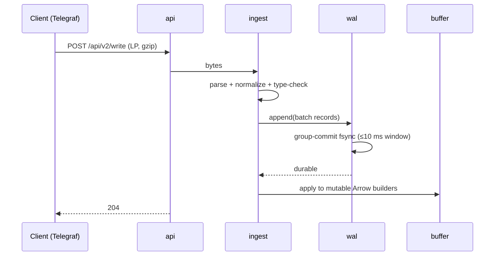
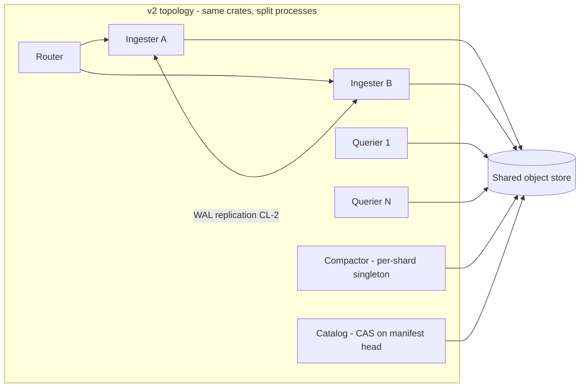

# TimelordDB — Architecture

**Status:** Draft v1 · 2026-08-08 · companion to `REQUIREMENTS.md`
(requirement IDs cited throughout; anything here that can't name its
requirement is decoration and should be challenged).

**Stack (decided, §11):** Rust · Apache DataFusion (SQL + vectorized
execution + memory pool) · Arrow (in-memory columnar, dictionary encoding)
· Parquet (immutable storage format) · `object_store` (storage
abstraction) · `arrow-flight` (Flight SQL surface).

---

## 1. System overview

One process in v1, but internally structured as the services v2 will
split apart (CL-1). Every arrow in this diagram is a Rust trait boundary.


Two invariants shape everything:

1. **RR-1:** queries execute inside an admission-controlled DataFusion
   `MemoryPool`; the process never dies from a query.
2. **CL-1:** the object store (+ manifest log inside it) is the source of
   truth; local disk holds only WAL segments and caches, both
   reconstructable. `rm -rf` the node, point a new one at the store,
   and it serves.

## 2. Requirements → architectural commitments

| Requirement | Commitment |
|---|---|
| FR-2 no series index | Tags are Arrow dictionary columns end-to-end; no structure grows with distinct-tag-combination count |
| RR-1 no query kills | One shared `MemoryPool` (default 20% RAM, configurable) + admission queue + spill-capable operators |
| SEC-1 encryption later | Single `Store` trait wraps *all* object reads/writes; encryption becomes a `Store` decorator |
| SEC-2 visibility labels later | Planner has exactly one mandatory-predicate injection hook, called for every table scan |
| CL-1 cluster-ready | `Catalog`, `Wal`, `Store` are traits; no component assumes sole ownership except via catalog commits |
| FR-7 per-table retention | Files never mix tables; partition time-spans align to retention granularity |
| PR-6 fresh-data penalty | Aggressive minutes-scale L0 compaction (the lever InfluxDB 3 Core lacks — its 26× gap is our headroom) |

## 3. Crate workspace

```
timelord/
  crates/
    server/      binary: wiring, config, lifecycle, /metrics
    api/         HTTP: /write, /api/v2/write, /api/v3/write_lp,
                 /health, /ping  (FR-1, FR-9 contract tests live here)
    ingest/      LP parser (zero-copy), schema normalization, type checks
    wal/         segmented WAL, fsync batching, replay, segment upload
    buffer/      mutable Arrow builders per (table, partition); snapshots
    store/       the Store trait + object_store impl  ← SEC-1 chokepoint
    catalog/     Catalog trait; manifest-log impl; local cache  ← CL-1 seam
    query/       DataFusion session factory, TableProvider,
                 memory pool + admission, predicate hook ← SEC-2, RR-1/2
    flight/      Flight SQL server (FR-8)
    compact/     L0→L1→L2 planner + executor (PR-6)
    retention/   per-table policy enforcement (FR-7)
    discovery/   Discovery trait; static backend (v1), Consul (v2)  ← CL-5
  tests/
    at/          AT-1..AT-6 harness glue (tsdb-bench adapter lives in
                 ../benchmark/backends/timelorddb.py, not here)
```

Consolidating crates later is cheap; splitting a tangle is not. Start
split where trait seams matter (`store`, `catalog`, `query`), merged
elsewhere if friction appears.

## 4. Data model

Line protocol maps to per-table Arrow schemas, created on first write
(schema-on-write, additive evolution only):

- **tags** → `Dictionary<Int32, Utf8>` columns (FR-2). At reference
  workload, `product_id`'s 2M values/day cost a dictionary, not an index.
- **fields** → typed columns (`Float64`, `Int64`, `Utf8`, `Boolean`);
  first writer wins the type, conflicts rejected with line context (FR-9).
- **time** → `Timestamp(Nanosecond)`; future timestamps are ordinary data
  (FR-4).
- **Primary key** = (time, all tags). Duplicate PK ⇒ last-write-wins,
  enforced by sort+dedup at flush and by merge at query/compaction
  (FR-5) — the IOx-proven approach.

## 5. Write path



- **Ack contract:** 204 means WAL-durable on local disk (v1). CL-2 (v2)
  upgrades this to replicated-or-uploaded without changing the API.
- **Flush:** a (table, partition) buffer flushes to Parquet when it hits
  size (default 128 MB) or age (default 5 min). Flush = write via `store`
  → catalog commit → WAL segments referenced by no buffer are dropped.
- **RR-3 (≤30 s to writable after crash):** recovery replays WAL into
  buffers *before* opening any Parquet. Bound WAL replay by capping
  un-flushed WAL at ~2 GB; replay is sequential Arrow building, ≥100 MB/s
  — worst case well inside budget. Catalog opens lazily after writes are
  accepted (1.8's minutes-long TSM reopen before writability is the
  anti-pattern).
- **Backpressure:** if buffers exceed their memory budget (§10), writes
  get 429 + Retry-After rather than unbounded memory growth (RR-5:
  visible, named limit).
- **PR-1/PR-2 (flat 75K lines/s):** parser is zero-copy over the request
  body; dictionary interning per batch; nothing on the hot path scales
  with historical distinct-key count — decay is structurally impossible,
  which is the lesson of the 2.x curve.

## 6. Storage layout & catalog

Object-store layout (all access through `store`):

```
/<db>/<table>/data/<partition>/<gen>-<uuid>.parquet
/<db>/<table>/wal/<segment>.wal          (uploaded segments, CL-1)
/catalog/manifest/<seq>-<uuid>.json      (append-only manifest log)
/catalog/checkpoint/<seq>.json           (periodic full snapshot)
```

- **Partition** = (table, UTC hour). Hour granularity aligns with FR-7
  retention (per-table, file-granular drops) and bounds file counts:
  reference workload ≈ 24–48 active partitions per table.
- **Catalog = manifest log in the object store** (Iceberg-style, decided
  over embedded-DB-as-truth): each commit (flush, compaction, retention
  drop, schema add) appends a manifest entry; checkpoints bound replay.
  v1 is single-writer so commits are trivially safe; CL-2/3 upgrade to
  conditional-put CAS on the manifest head — a catalog-impl change, not
  an engine change. A local embedded cache (redb) accelerates lookups and
  is disposable (CL-1).
- **Retention (FR-7):** enforcer walks per-table policies, drops whole
  partitions past their window via catalog commit; physical deletion is
  async garbage collection (and later, SEC-1 crypto-shredding).

## 7. Compaction (PR-6 is won or lost here)

| Level | Contents | Target size | Trigger |
|---|---|---|---|
| L0 | raw flushes (~minutes of data) | 16–128 MB | every flush |
| L1 | one (table, hour) merged + deduped | ≤ 1 GB | ≥ 4 L0 files in a partition, or partition age > 10 min |
| L2 | one (table, day), sorted by (time, entity) | ≤ 8 GB split | daily roll-up of settled hours |

- Merge = k-way sorted merge on PK with last-write-wins dedup (FR-5),
  streaming, under the same memory pool as queries (a compaction cannot
  kill the server either — RR-1 applies to internal work).
- **The design bet on PR-6:** InfluxDB 3 Core's 26× fresh-vs-settled gap
  exists because Core ships no compactor. Aggressive L0→L1 (minutes, not
  hours) keeps the per-query file count low enough that "fresh" ≈ "one
  hour of small files + settled rest," targeting the ≤10× budget.
- Compaction rewrites are also where SEC-1 key rotation and future
  re-sorting/re-clustering ride for free.

## 8. Read path

```
Flight SQL (flight) 
  → session {authorizations, limits}          (SEC-2 context)
  → SQL parse/plan (DataFusion)
  → for every table scan:
       mandatory_predicate(session, table)    ← the ONE injection point
       (v1: passthrough no-op; later: _visibility label filter,
        retention boundary, tenant scoping)
  → TableProvider = union of:
       a) buffer snapshot (zero-copy Arrow, immutable view)
       b) Parquet files from catalog, pruned by:
            partition time-range → row-group stats → bloom filters
  → dedup merge across overlapping files (PK last-write-wins)
  → execution under MemoryPool + admission queue     (RR-1)
  → stream results; client disconnect aborts plan ≤5 s   (RR-2)
```

- **RR-1 mechanics:** one pool, default 20% of RAM; per-query
  reservation cap (default pool/4); admission queue when the pool is
  contended; spill enabled for sort/aggregate/join. Rejection is a named,
  documented error (RR-5) — the graceful behavior we measured, made
  default.
- **RR-2:** every query runs under a cancellation token tied to the
  Flight stream; drop = abort. The 2.x pattern (abandoned queries
  grinding server-side toward the 1.x kill) is structurally closed.
- **PR-9 (reads during writes):** buffer snapshots are immutable Arrow
  views — readers never lock writers.
- **Distinct-count funnels (PR-4/5):** exact `COUNT(DISTINCT)` via
  DataFusion, executed on dictionary *keys* where the optimizer allows —
  distinct over Int32 keys, not strings. Approximate sketches (HLL) are
  explicitly out unless a future requirement asks.

## 9. Shape A plan (PR-3: ≤250 ms, stretch ≤50 ms)

Three rungs, cheapest first; the harness decides how far to climb:

1. **Baseline pruning (build always):** Parquet row-group stats + bloom
   filters on `product_id` per row group. Expected to beat InfluxDB 3's
   607 ms (its pruning, plus our smaller settled file count).
2. **Bounded recent-entity locator (the §13 experiment):** an evictable
   map `entity → {partition, row-groups}` for the hot window (default
   48 h), built at flush/compaction from bloom digests. Hard memory cap
   (default 256 MB), LRU eviction, rebuildable from files — *bounded and
   disposable*, therefore not AR-1's forbidden index. This chases 1.8's
   18 ms proof without inheriting its 11 GB/OOM economics.
3. **If still short:** L2 re-cluster by (entity bucket, time) to localize
   journeys physically. Only if the harness says rungs 1–2 miss.

## 10. Memory budget (reference box: 16 GB — RR-1/RR-4)

| Component | Budget (default) | Enforcement |
|---|---|---|
| Query/compaction pool | 3.2 GB (20%) | DataFusion MemoryPool, spill, admission |
| Write buffers (all tables) | 2 GB | flush pressure, then 429 backpressure |
| WAL un-flushed cap | 2 GB on disk | backpressure (bounds RR-3 replay) |
| Parquet metadata + bloom cache | 512 MB | LRU |
| Recent-entity locator (§9) | 256 MB | LRU, evictable to zero |
| Dictionaries in-flight, misc | ~1 GB | bounded by batch lifecycle |
| **Idle steady state** | **≤ 6 GB (RR-4)** | budgets above are caps, not reservations |

## 11. Security hooks (SEC — designed now, wired later)

- **`Store` chokepoint (SEC-1):** `trait Store { get, put, delete, list }`
  over `object_store`. Encryption ships as `EncryptingStore(inner, kms)` —
  a decorator; the engine never knows. Direction: Parquet Modular
  Encryption for per-column keys; fallback if arrow-rs PME lags (§13
  open question): whole-object envelope encryption at the same seam.
- **Predicate hook (SEC-2):** `fn mandatory_predicate(session, table) ->
  Option<Expr>` — called unconditionally by the TableProvider, composed
  with AND below any user predicate, *before* aggregation. v1 returns
  `None`; the visibility-label filter, retention boundaries, and tenant
  scoping all arrive as implementations of this one function. Aggregate
  leakage is impossible by construction because the filter is part of the
  scan, not the API.
- **TLS 1.3 everywhere, built for daily cert rotation (SEC-3):** one
  rustls `ServerConfig` shared by the HTTP stack (axum/hyper) and Flight
  SQL (tonic), TLS 1.3 with a configurable 1.2 floor. Rotation mechanics:
  the server installs a custom `ResolvesServerCert` holding an
  `ArcSwap<CertifiedKey>`; a file watcher (notify crate, debounced) plus
  an admin endpoint trigger reloads. A reload parses and validates the
  new pair (expiry, key↔cert match) *before* an atomic pointer swap —
  a bad renewal is rejected, the last-good pair keeps serving, and a
  named alarm + `tls_cert_expiry_seconds` metric fire (RR-5). Because
  rustls consults the resolver only at handshake, established
  connections and in-flight Flight streams are structurally unaffected
  by rotation — no draining logic exists to get wrong. v2 mTLS puts the
  client-cert verifier's `RootCertStore` behind the same ArcSwap with
  dual-CA overlap for independent client/server rolls. Pure-Rust rustls
  keeps OpenSSL out of the build. AT-6 exercises Telegraf/Grafana over
  TLS; AT-7 is the rotation-under-load drill.

## 12. Clustering evolution (CL)



v1 runs all roles in one process behind the same traits. The v2 split
changes deployment, not architecture: ingesters replicate WAL before ack
(CL-2), queriers are stateless over store+catalog (CL-3), the catalog
gains conditional-put arbitration, and any node rebuilds from the store
(CL-4, bounded by cache warmup). Nothing in v1 may violate this diagram —
that is CL-1's practical meaning.

**Membership & discovery (CL-5).** Topology comes from the `Discovery`
trait: `members(role)`, `register(self)`, `watch()`, and `lease(name)`
for role election. Backends: **static** (config file — v1, dev, and the
bench harness) and **Consul** (service registration + health checks +
sessions for the compactor-singleton lease). Two rules keep this honest:
discovery informs *routing and availability only* — a stale or lying
membership view can waste work but never corrupt state, because every
commit still goes through catalog CAS; and leases are advisory
optimizations — the compactor holds a Consul lease to avoid duplicate
work, but a double-fired compaction is safe (both produce valid file
sets; catalog CAS accepts one, GC collects the loser). Intra-cluster
links discovered this way connect over mTLS (SEC-3).

## 13. Observability (SR-4)

Prometheus `/metrics` (ingest rate, WAL depth, buffer bytes, flush/
compaction lag, pool usage, admission queue depth, per-query peak memory),
`/health` + `/ping` (FR-9), structured query log with memory/rows/pruning
stats, and `system.*` virtual tables (files, partitions, retention state)
so the harness never has to shell into a container again.

## 14. Milestones — each one measurable by the harness

| M | Deliverable | Gate (tsdb-bench) |
|---|---|---|
| M0 | Workspace, CI, `timelorddb` bench adapter + compose target (AT-1) | adapter health-checks against a stub |
| M1 | Ingest path: LP endpoints → WAL → buffer; SQL over buffer only | smoke ingest + context counts exact (AT-2) |
| M2 | Flush → Parquet → catalog; reads union buffer+files; restart recovery | smoke full suite green; kill-during-load recovers ≤30 s |
| M3 | Compaction + per-table retention; Flight SQL; Grafana renders | laptop scale; dashboards fixture (AT-6 read half) |
| M4 | Memory pool + admission + cancellation hardening; bloom pruning | **full scale: PR-1..PR-9, RR-1..RR-4 (AT-3)** |
| M5 | Telegraf contract tests, backup/restore drill, repeat runs | AT-4, AT-5, AT-6 complete |

The rule from `CLAUDE.md` stands: the harness is the spec. No milestone
is "done" on unit tests alone.

## 15. Decisions and alternatives considered

| Decision | Chose | Over | Because |
|---|---|---|---|
| Catalog | Object-store manifest log + local cache | Embedded DB as source of truth | CL-1: truth must survive node loss; single-writer v1 makes commits trivial; CAS upgrade path for v2 |
| Partition | (table, hour) | (table, 10-min) à la Core | Fewer files (the 72 h query-file-limit lesson), aligns with FR-7 drops; L0 gives intra-hour freshness |
| Dedup | Sort+merge LWW at flush/compact/query | Write-time global lookup | The lookup is a hidden series-index (AR-1); merge is the columnar-native answer |
| Distinct | Exact, on dictionary keys | HLL sketches | PR-4/5 targets are achievable exactly; sketches change answers, not just costs |
| Shape A | Pruning + bounded locator experiment | Full inverted entity index | AR-1 — 1.8 showed both the 18 ms ceiling and the price we refuse |
| WAL | Custom segmented records (bincode/rkyv) | Reusing Parquet as WAL | WAL wants append+fsync semantics, not columnar layout; segments upload as-is for CL-1 |
| Ack | WAL-durable (v1) | Buffer-only ack | 0-errors-under-burst (PR-7) is meaningless if ack precedes durability |

## 16. Risks (each with its falsification test)

1. **Ingest target (PR-1/2) with WAL fsync on the path** — group commit
   must sustain 75K lines/s. *Test at M1 with bench ingest; if short,
   fsync window tuning before architecture changes.*
2. **arrow-rs Parquet Modular Encryption maturity (SEC-1)** — *spike at
   M2; fallback (envelope-at-chokepoint) already designed.*
3. **Fresh-penalty budget (PR-6 ≤10×)** — depends on L0 cadence under
   load. *Measured from M3 via `--scenarios query_b` on just-ingested
   data.*
4. **Distinct-on-dictionary optimization availability** — if DataFusion
   materializes strings for DISTINCT, funnel memory grows. *Check plan
   output at M2; contribute upstream or pre-aggregate per partition.*
5. **Single-writer catalog becomes v2 contention point** — *CAS design
   reviewed before M4; Iceberg prior art.*
