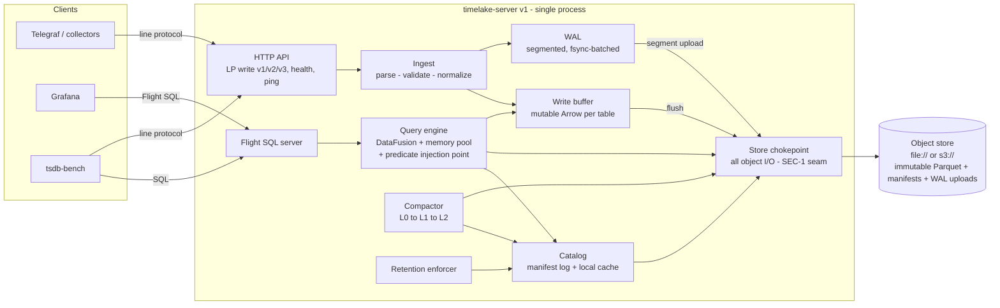
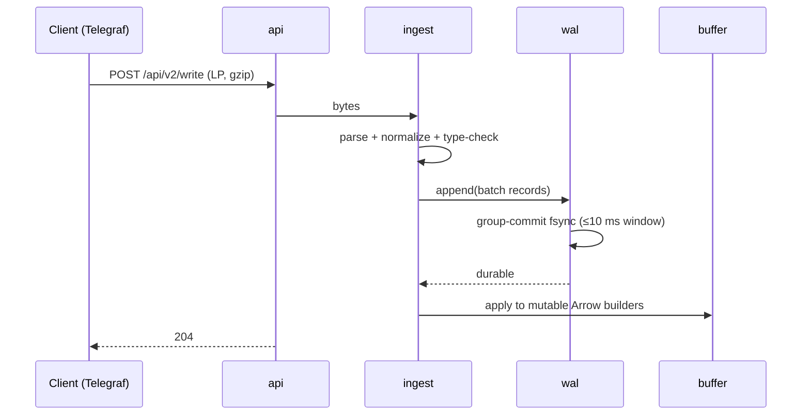
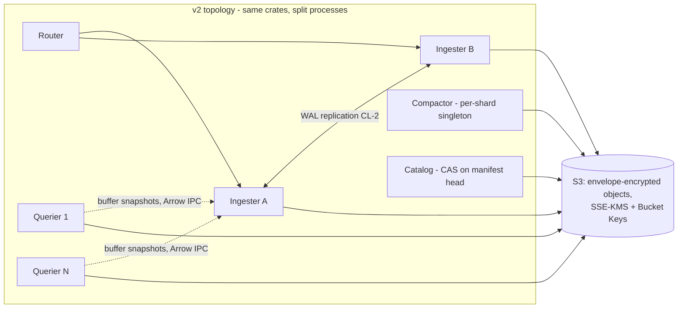

# TimeLakeDB — Architecture

**Status:** Draft v1 · 2026-08-08 · companion to `REQUIREMENTS.md`
(requirement IDs cited throughout; anything here that can't name its
requirement is decoration and should be challenged).

**Stack (decided, §11):** Rust · Apache DataFusion (SQL + vectorized
execution + memory pool) · Arrow (in-memory columnar, dictionary encoding)
· Parquet (immutable storage format) · `object_store` (storage
abstraction) · `arrow-flight` (Flight SQL surface) · aws-sdk-kms +
SSE-KMS/Bucket Keys for the S3 era (§12.2) · LocalStack as the
cluster test rig (§12.6).

---

## 1. System overview

One process in v1, but internally structured as the services v2 will
split apart (CL-1). Every arrow in this diagram is a Rust trait boundary.



Two invariants shape everything:

1. **RR-1:** queries execute inside an admission-controlled DataFusion
   `MemoryPool`; the process never dies from a query.
2. **CL-1:** the object store (+ manifest log inside it) is the source of
   truth; local disk holds only WAL segments and caches, both
   reconstructable. `rm -rf` the node, point a new one at the store,
   and it serves.

## 2. Requirements → architectural commitments

| Requirement | Commitment |
|---|---|
| FR-2 no series index | Tags are Arrow dictionary columns end-to-end; no structure grows with distinct-tag-combination count |
| RR-1 no query kills | One shared `MemoryPool` (default 20% RAM, configurable) + admission queue + spill-capable operators |
| SEC-1 encryption | Single `Store` trait wraps *all* object reads/writes; encryption IS a `Store` decorator (shipped — §11) |
| SEC-2 visibility labels | Exactly one mandatory-predicate injection hook, called for every table scan (shipped — §11) |
| CL-1 cluster-ready | `Catalog`, `Wal`, `Store` are traits; no component assumes sole ownership except via catalog commits |
| FR-7 per-table retention | Files never mix tables; partition time-spans align to retention granularity |
| PR-6 fresh-data penalty | Aggressive minutes-scale L0 compaction (the lever InfluxDB 3 Core lacks — its 26× gap is our headroom) |

## 3. Crate workspace

```
timelake/
  crates/
    server/      binary: wiring, config, lifecycle, /metrics
    api/         HTTP: /write, /api/v2/write, /api/v3/write_lp,
                 /health, /ping  (FR-1, FR-9 contract tests live here)
    ingest/      LP parser (zero-copy), schema normalization, type checks
    wal/         segmented WAL, fsync batching, replay, segment upload
    buffer/      mutable Arrow builders per (table, partition); snapshots
    store/       the Store trait + object_store impl  ← SEC-1 chokepoint
    catalog/     Catalog trait; manifest-log impl; local cache  ← CL-1 seam
    query/       DataFusion session factory, TableProvider,
                 memory pool + admission, predicate hook ← SEC-2, RR-1/2
    flight/      Flight SQL server (FR-8)
    compact/     L0→L1→L2 planner + executor (PR-6)
    retention/   per-table policy enforcement (FR-7)
    discovery/   Discovery trait; static backend (v1), Consul (v2)  ← CL-5
    tls/         validate-before-swap cert loading, rotation  ← SEC-3
    store-s3/    S3Store + AwsKms behind the Store/Kms traits  ← CL-1, C0
    auth/        principals, sessions, roles                  ← SEC-4
  (planned, not yet built)
    config/      layered resolver (default < property < override),
                 provenance, validation, hot-swap holder      ← §17, U0
    audit/       chained append-only sink, system.audit       ← SR-6, U1
    admin/       admin listener: console REST API + embedded UI ← SR-5, U0
  tests/
    at/          AT-1..AT-6 harness glue (tsdb-bench adapter lives in
                 ../Gauge/bench/backends/timelakedb.py, not here)
```

Consolidating crates later is cheap; splitting a tangle is not. Start
split where trait seams matter (`store`, `catalog`, `query`), merged
elsewhere if friction appears.

## 4. Data model

Line protocol maps to per-table Arrow schemas, created on first write
(schema-on-write, additive evolution only):

- **tags** → `Dictionary<Int32, Utf8>` columns (FR-2). At reference
  workload, `product_id`'s 2M values/day cost a dictionary, not an index.
- **fields** → typed columns (`Float64`, `Int64`, `Utf8`, `Boolean`);
  first writer wins the type, conflicts rejected with line context (FR-9).
- **time** → `Timestamp(Nanosecond)`; future timestamps are ordinary data
  (FR-4).
- **Primary key** = (time, all tags). Duplicate PK ⇒ last-write-wins,
  enforced by sort+dedup at flush and by merge at query/compaction
  (FR-5) — the IOx-proven approach.

## 5. Write path



- **Ack contract:** 204 means WAL-durable on local disk (v1). CL-2 (v2)
  upgrades this to replicated-or-uploaded without changing the API.
- **Flush:** a (table, partition) buffer flushes to Parquet when it hits
  size (default 128 MB) or age (default 5 min). Flush = write via `store`
  → catalog commit → WAL segments referenced by no buffer are dropped.
- **RR-3 (≤30 s to writable after crash):** recovery replays WAL into
  buffers *before* opening any Parquet. Bound WAL replay by capping
  un-flushed WAL at ~2 GB; replay is sequential Arrow building, ≥100 MB/s
  — worst case well inside budget. Catalog opens lazily after writes are
  accepted (1.8's minutes-long TSM reopen before writability is the
  anti-pattern).
- **Backpressure:** if buffers exceed their memory budget (§10), writes
  get 429 + Retry-After rather than unbounded memory growth (RR-5:
  visible, named limit).
- **PR-1/PR-2 (flat 75K lines/s):** parser is zero-copy over the request
  body; dictionary interning per batch; nothing on the hot path scales
  with historical distinct-key count — decay is structurally impossible,
  which is the lesson of the 2.x curve.

## 6. Storage layout & catalog

Object-store layout (all access through `store`):

```
/<db>/<table>/data/<partition>/<gen>-<uuid>.parquet
/<db>/<table>/wal/<segment>.wal          (uploaded segments, CL-1)
/catalog/manifest/<seq>-<uuid>.json      (append-only manifest log)
/catalog/checkpoint/<seq>.json           (periodic full snapshot)
```

- **Partition** = (table, UTC hour). Hour granularity aligns with FR-7
  retention (per-table, file-granular drops) and bounds file counts:
  reference workload ≈ 24–48 active partitions per table.
- **Catalog = manifest log in the object store** (Iceberg-style, decided
  over embedded-DB-as-truth): each commit (flush, compaction, retention
  drop, schema add) appends a manifest entry; checkpoints bound replay.
  commits are **conditional-put CAS on the next sequence key** (P0-4,
  shipped): a writer claims `catalog/manifest/{seq}.json` with
  `put_if_absent`, and the loser of a race replays the winner's entry and
  retries at the new head, so two writers on one bucket cannot lose each
  other's commits. `timelake_catalog_commit_conflicts_total` makes the
  contention visible. A local embedded cache (redb) accelerates lookups
  and is disposable (CL-1).
- **Retention (FR-7):** enforcer walks per-table policies, drops whole
  partitions past their window via catalog commit; physical deletion is
  async garbage collection (and later, SEC-1 crypto-shredding).

## 7. Compaction (PR-6 is won or lost here)

| Level | Contents | Target size | Trigger |
|---|---|---|---|
| L0 | raw flushes (~minutes of data) | 16–128 MB | every flush |
| L1 | one (table, hour) merged + deduped | ≤ 1 GB | ≥ 4 L0 files in a partition, or partition age > 10 min |
| L2 | one (table, day), sorted by (time, entity) | ≤ 8 GB split | daily roll-up of settled hours |

- Merge = k-way sorted merge on PK with last-write-wins dedup (FR-5),
  streaming, under the same memory pool as queries (a compaction cannot
  kill the server either — RR-1 applies to internal work).
- **The design bet on PR-6:** InfluxDB 3 Core's 26× fresh-vs-settled gap
  exists because Core ships no compactor. Aggressive L0→L1 (minutes, not
  hours) keeps the per-query file count low enough that "fresh" ≈ "one
  hour of small files + settled rest," targeting the ≤10× budget.
- Compaction rewrites are also where SEC-1 key rotation and future
  re-sorting/re-clustering ride for free.

## 8. Read path

```
Flight SQL (flight) 
  → session {authorizations, limits}          (SEC-2 context)
  → SQL parse/plan (DataFusion)
  → for every table scan:
       mandatory_predicate(session, table, schema)  ← the ONE injection point
       (shipped: _visibility label filter, applied in-scan to every
        batch; later variants: retention boundary, tenant scoping)
  → TableProvider = union of:
       a) buffer snapshot (zero-copy Arrow, immutable view)
       b) Parquet files from catalog, pruned by:
            partition time-range → row-group stats → bloom filters
  → dedup merge across overlapping files (PK last-write-wins)
  → execution under MemoryPool + admission queue     (RR-1)
  → stream results; client disconnect aborts plan ≤5 s   (RR-2)
```

- **RR-1 mechanics:** one pool, default 20% of RAM; per-query
  reservation cap (default pool/4); admission queue when the pool is
  contended; spill enabled for sort/aggregate/join. Rejection is a named,
  documented error (RR-5) — the graceful behavior we measured, made
  default.
- **RR-2:** every query runs under a cancellation token tied to the
  Flight stream; drop = abort. The 2.x pattern (abandoned queries
  grinding server-side toward the 1.x kill) is structurally closed.
- **PR-9 (reads during writes):** buffer snapshots are immutable Arrow
  views — readers never lock writers.
- **Distinct-count funnels (PR-4/5):** exact `COUNT(DISTINCT)` via
  DataFusion, executed on dictionary *keys* where the optimizer allows —
  distinct over Int32 keys, not strings. Approximate sketches (HLL) are
  explicitly out unless a future requirement asks.

## 9. Shape A plan (PR-3: ≤250 ms, stretch ≤50 ms)

Three rungs, cheapest first; the harness decides how far to climb:

1. **Baseline pruning (build always):** Parquet row-group stats + bloom
   filters on `product_id` per row group. Expected to beat InfluxDB 3's
   607 ms (its pruning, plus our smaller settled file count).
2. **Bounded recent-entity locator (the §13 experiment):** an evictable
   map `entity → {partition, row-groups}` for the hot window (default
   48 h), built at flush/compaction from bloom digests. Hard memory cap
   (default 256 MB), LRU eviction, rebuildable from files — *bounded and
   disposable*, therefore not AR-1's forbidden index. This chases 1.8's
   18 ms proof without inheriting its 11 GB/OOM economics.
3. **If still short:** L2 re-cluster by (entity bucket, time) to localize
   journeys physically. Only if the harness says rungs 1–2 miss.

## 10. Memory budget (reference box: 16 GB — RR-1/RR-4)

| Component | Budget (default) | Enforcement |
|---|---|---|
| Query/compaction pool | 3.2 GB (20%) | DataFusion MemoryPool, spill, admission |
| Write buffers (all tables) | 2 GB | flush pressure, then 429 backpressure |
| WAL un-flushed cap | 2 GB on disk | backpressure (bounds RR-3 replay) |
| Parquet metadata + bloom cache | 512 MB | LRU |
| Recent-entity locator (§9) | 256 MB | LRU, evictable to zero |
| Dictionaries in-flight, misc | ~1 GB | bounded by batch lifecycle |
| **Idle steady state** | **≤ 6 GB (RR-4)** | budgets above are caps, not reservations |

## 11. Security hooks (SEC — SEC-1/SEC-2/SEC-3 shipped)

- **`Store` chokepoint (SEC-1 — SHIPPED):** encryption is
  `EncryptingStore(inner, kms)` — a decorator on the one object-I/O
  trait; the engine cannot tell. Every object (Parquet, manifest,
  checkpoint) gets a fresh AES-256-GCM data key, wrapped by the KMS
  (v1: a local KEK from `TIMELAKE_ENCRYPTION_KEY[_FILE]`; the `Kms`
  trait is where per-table scoping and real KMS backends arrive).
  Objects are encrypted in 64 KiB chunks, one auth tag each, with the
  header and object path as AAD — chunks cannot be reordered, spliced
  across objects, or truncated undetected. Chunking exists because the
  read path is range reads: a bloom probe decrypts a few KB, not the
  file. *Decision vs the original sketch:* whole-object envelope at the
  chokepoint was chosen over Parquet Modular Encryption (§16 risk 2) —
  it covers manifests too and owes nothing to arrow-rs PME maturity.
  PME per-column keys remain the evolution, at this same seam.
  Plaintext objects written before a key was configured stay readable;
  the local WAL is out of scope (it holds minutes of data and dies with
  the node; CL-2 WAL uploads will pass through the same store).
- **Predicate hook (SEC-2 — SHIPPED):** `fn mandatory_predicate(session,
  table, schema) -> Option<Restriction>` — called unconditionally by the
  TableProvider inside `scan()`, applied to every batch (buffer and
  file) below any user predicate and *before* aggregation; a COUNT(*)
  that never touches the label column still reads it and still cannot
  count a hidden row. v1 restriction: Accumulo-style row visibility —
  a `_visibility` dictionary tag holds expressions like
  `(ops&audit)|admin`, evaluated per distinct label against the
  session's authorizations (HTTP `X-TimeLake-Authorizations` /
  Flight SQL metadata). Unlabeled rows are public; malformed labels are
  visible to no one (fail closed). Retention boundaries and tenant
  scoping arrive as further `Restriction` variants through this same
  hook. Note: until token auth lands (§12), authorizations are claims,
  not credentials — SECURITY.md is explicit about this.
  Observability: `timelake_visibility_rows_filtered_total`,
  `timelake_encryption_enabled`.
- **TLS 1.3 everywhere, built for daily cert rotation (SEC-3):** one
  rustls `ServerConfig` shared by the HTTP stack (axum/hyper) and Flight
  SQL (tonic), TLS 1.3 with a configurable 1.2 floor. Rotation mechanics:
  the server installs a custom `ResolvesServerCert` holding an
  `ArcSwap<CertifiedKey>`; a file watcher (notify crate, debounced) plus
  an admin endpoint trigger reloads. A reload parses and validates the
  new pair (expiry, key↔cert match) *before* an atomic pointer swap —
  a bad renewal is rejected, the last-good pair keeps serving, and a
  named alarm + `tls_cert_expiry_seconds` metric fire (RR-5). Because
  rustls consults the resolver only at handshake, established
  connections and in-flight Flight streams are structurally unaffected
  by rotation — no draining logic exists to get wrong. Pure-Rust rustls
  keeps OpenSSL out of the build. AT-6 exercises Telegraf/Grafana over
  TLS; AT-7 is the rotation-under-load drill.
- **Client certificates in WANT mode (SEC-3 v2, shipped):** the
  client-cert verifier's `RootCertStore` sits behind the same ArcSwap
  and the same validate-before-swap reload as the serving pair, with
  **dual-CA overlap** so client and server CAs roll independently. The
  verifier is deliberately non-mandatory: it reports
  `client_auth_mandatory() = false` and implements
  `allow_unauthenticated()`, so a client that presents a certificate is
  verified and identified while one that does not is still served. That
  choice is what makes it deployable without a flag day — stock Grafana
  and Telegraf hold no client certificate and must keep working (FR-8/
  FR-9/AT-6). The identity earns something rather than merely existing:
  `QuerySession::resolve` intersects a verified caller's SEC-2 claims
  with its grants, so authenticating can only narrow what it sees. The
  anonymous path is unchanged, which is why this is additive.
  **Requiring** a certificate is a separate decision, and the sensible
  place for it is the intra-cluster listener at C3, where there is no
  Grafana to keep working.

## 12. Clustering v2 on S3 (CL-1..CL-5 + SEC-1 on AWS) — design

**Status: designed 2026-08-09; build phased C0–C3 (§14).** Every seam
this composes from is already shipped: the `Store` chokepoint with
`EncryptingStore` and the `Kms` trait (SEC-1), the sequence-keyed
manifest-log catalog, the `Discovery` trait, and one binary that
composes every role.



The v2 split changes deployment, not architecture: nothing below adds a
trait that v1 lacks — that is CL-1's practical meaning, kept.

### 12.1 S3Store (CL-1 made real)

`S3Store` implements `Store` over **aws-sdk-s3** (build-time deviation
from the original `object_store` sketch, recorded in the crate docs: the
SDK exposes exact control of SSE-KMS, `bucket-key-enabled`, and
`If-None-Match` — which is the point; the abstraction that matters is
our own `Store` trait, unchanged). It holds its **own tokio runtime**
for the sync↔async bridge — engine threads call the store from
`spawn_blocking` contexts *and* from async contexts, and `block_on`
there panics; work is spawned onto the owned runtime and awaited over a
channel, safe from any thread. Mapping: `put` →
PutObject (SSE headers below; multipart when L2 splits exceed single-PUT
limits), `get_range` → ranged GET (the seam range reads were built for),
`list` → ListObjectsV2 (lexicographic — exactly what manifest replay
requires), `size` → catalog-recorded sizes on the hot path, HeadObject
otherwise. Config: `TIMELAKE_OBJECT_STORE=s3://bucket/prefix` (unset =
local directory, as today); `AWS_ENDPOINT_URL` + path-style addressing
for LocalStack. Per-op request/byte/retry counters feed `/metrics`.

**One new trait method — the CAS primitive:** `put_if_absent(path,
bytes) -> Ok(true)|Ok(false)` (S3: PUT + `If-None-Match: *`, 412 = the
other writer won; LocalStore: `File::create_new`; EncryptingStore:
passthrough with encryption). Everything multi-writer reduces to this.

### 12.2 KMS: envelope client-side + SSE-KMS server-side, both cached

Two layers, each with its own key cache, because each layer otherwise
pays one KMS call per object at thousands of objects per day:

- **Client-side (SEC-1, shipped path):** `EncryptingStore` unchanged.
  `AwsKms` implements `Kms` via aws-sdk-kms; the trait gains
  `generate() -> (dek, wrapped)` with a default impl (OsRng + `wrap`) so
  `LocalKek` is untouched — GenerateDataKey returns exactly that pair in
  one call (CiphertextBlob ≈ 184 B, inside the header's 4 KiB wrap cap).
- **`CachingKms` decorator** (the caching-CMM pattern): encrypt-side,
  one (dek, wrapped) pair reused until max-age (default 300 s) or
  max-uses (default 1,000, hard cap 2¹⁶); decrypt-side, a bounded LRU of
  wrapped-blob → dek (4,096 entries) so re-opened files cost zero KMS
  calls. Nonce safety under reuse: each object still draws a random
  64-bit nonce prefix, so ≤1,000 objects per DEK puts cross-object
  nonce-collision odds near 2⁻⁴⁵. SEC-1's "per-object data keys" is
  hereby amended to "per-window, bounds configurable" — recorded in
  REQUIREMENTS §8. Keys live only in memory; caches are size- and
  age-bounded. Metrics: `timelake_kms_generate_total`,
  `timelake_kms_decrypt_total`, cache-hit counters — the drill turns
  "reduces KMS cost" into a measured before/after number.
- **Server-side:** every PUT carries SSE-KMS headers with
  **S3 Bucket Keys enabled** — S3's own key cache; without it SSE-KMS
  costs a KMS call per object and no client code can help. Key ids:
  `TIMELAKE_KMS_KEY_ID` (client layer) and `TIMELAKE_S3_SSE_KEY_ID`
  (defaults to the same; separate for blast-radius isolation if wanted).
- Honesty about the money: at reference scale the dollar cost is small
  (~10⁴ calls/day ≈ cents) — the cache's real wins are **latency off the
  flush path** (a KMS round trip per L0 file otherwise), survival of KMS
  throttling/outage windows, and call-count hygiene that stays flat as
  the fleet grows.

### 12.3 Catalog: CAS on the manifest head + checkpoints

**The CAS commit is shipped (P0-4).** The manifest log is sequence-keyed
(`catalog/manifest/{seq:012}.json`), so two writers racing commit seq N
collide on the **same object key** — `put_if_absent` makes exactly one
win. Commit is a loop: propose seq = head+1 → `put_if_absent` → on loss,
list-and-replay entries past the local head, fold them into memory,
re-propose at the new head. Bounded (100 attempts → `ResourceBusy`);
commits are small and rare, contention negligible at this fleet size;
`timelake_catalog_commit_conflicts_total` counts the races. Drilled on
both the local hard-link and the real S3 `If-None-Match`
(`docs/evidence/catalog-cas-drill.log`).

One refinement is deferred to C2 with the role split: **re-validating
the commit against the new state on conflict** — a compaction whose
inputs were concurrently retention-dropped should abort rather than
resurrect dropped data in its output (the orphan output then falls to
GC). It is safe to defer because maintenance (the only source of
compaction/retention commits) is single-node until C2, so a compaction
and a retention drop cannot race today. The retry loop already re-applies
removals correctly; what C2 adds is the abort decision.
**Checkpoints** (`catalog/checkpoint/{seq}.json`, every 512 entries,
also via `put_if_absent`) bound boot to newest-checkpoint + tail replay
instead of a full-log LIST/GET storm. GC grace now protects the whole
fleet's in-flight queries: it must exceed the maximum query timeout of
any node, not just the local one.

### 12.4 Roles: one binary, `TIMELAKE_ROLE`

`all` (v1 default — today's behavior, bench fixtures unchanged) |
`router` | `ingester` | `querier` | `compactor`. Same crates throughout.

**Foundation shipped (C2 phase 1).** The `timelake-cluster` crate holds
the `Role` enum (`TIMELAKE_ROLE`, default `all`) and the `Discovery`
seam (§12.5) with a static backend. `all` is unchanged — the whole stack
in one process, bench and fixtures untouched. The specialised roles are
built one phase at a time; **a role whose phase has not landed is refused
at startup** (`exit 2` with a named message) rather than started
half-built, so no one deploys an ingester that does not replicate. The
node logs its role, id, and resolved peers at boot. The compactor role is
built (phase 5a, 2026-08-21) and still refused by `Role::implemented` —
see its bullet below for why, and why the lease this sentence used to
promise was replaced by a commit fence.

- **Router — shipped (C2 phase 3, reads added in phase 4).** Stateless, holds no data,
  opens no engine. It hashes each line's `(db, measurement)` → one
  ingester and forwards that shard; the chosen ingester becomes the
  table's primary and replicates to its CL-2 peer, so durability is
  unchanged. It is the single write endpoint the bench adapter, Telegraf
  and Grafana keep seeing (FR-8/FR-9). Atomicity holds: the whole body is
  parsed with the ingesters' own parser, under the client's precision,
  before any shard is forwarded, so a poison line writes zero (until
  2026-08-23 the check was measurement-presence only and a bad *field*
  landed every shard but its own — #38; the cost of the full parse was
  measured with Gauge through the router before it landed);
  a shard forward that fails for infrastructure reasons is returned for an
  idempotent retry (LWW dedup). Sharding is FNV-1a over `db\0measurement`
  mod N (stable across restarts), with the ingester list sorted so a table
  always lands on the same node.
  **Queries (phase 4):** `/api/sql` is forwarded to a querier — never to a
  shard, because a query is only correct once every shard is unioned.
  Round-robin, falling through to the next querier on a *transport*
  failure (a dead querier must cost a retry, not half the queries) but
  never on an HTTP status, which is a real answer — including a querier's
  own refusal to answer from an incomplete cluster. Credential headers
  pass through untouched: the querier is where SEC-2 visibility and SEC-4
  data auth are decided — and on **writes** the client's `Authorization`
  travels with every shard for the same reason, the ingester being where
  a write is authenticated (it was dropped there until 2026-08-22, #37,
  which made `required` mode impossible behind a router; drilled by
  `deploy/compose/timelakedb-router-auth.yml`). A router with no queriers configured still
  answers 501 rather than guessing at an ingester. Flight SQL is served by
  queriers directly, not forwarded — the router speaks HTTP only.
  Metrics `timelake_router_{forwarded,forward_errors,rejected,ingesters,
  queries_forwarded,query_errors,queriers}`.
- **Ingester (CL-2) — shipped (C2 phase 2).** Write path per §5 plus:
  ship the WAL frame to the paired ingester **before the 204**
  ("replicated"), so an acknowledged write is durable on two nodes. Peer
  down ⇒ **degraded mode, loudly**: keep accepting on local durability
  with the `CL2_REPLICATION_DEGRADED` alarm and the
  `timelake_cl2_degraded` gauge rather than failing writes (PR-7 outranks
  replication when a pair is half up); the gauge clears when the peer
  returns. The peer holds frames in a durable **replica WAL**, dormant
  (not applied) in steady state so it does not double-flush the peer's
  live rows. A dead ingester's rows recover by replaying that replica WAL
  and flushing; overlap with rows the dead peer already flushed is safe
  because LWW dedup (FR-5) makes it idempotent. Drilled: SIGKILL an
  ingester, recover on the peer, zero acknowledged loss, exact count
  (`docs/evidence/cl2-replication-drill.log`). **Deliberately deferred:**
  recovery is explicit here (operator / the router on a confirmed peer
  death); automatic health-triggered failover is a later phase.
  Transport is plaintext HTTP on `TIMELAKE_CLUSTER_ADDR` at C2, behind a
  `Replicator` seam, moving to required-mTLS (and possibly a streaming
  gRPC/Flight wire if the per-batch round-trip becomes the bottleneck) at
  C3. Each ingester flushes its own buffers to S3 and commits via catalog
  CAS.
- **Querier (CL-3) — shipped (C2 phase 4), reads.** Stateless: replays
  the catalog from S3, then tails the manifest log (~1 s poll of the list
  past its head — cheap). It opens no write path at all: a write sent to
  a querier is refused with 501, because accepting it would acknowledge a
  write durable nowhere the cluster reads. It runs no maintenance either
  — compaction and retention belong to the compactor, and a second one
  would be a second writer.
  **Freshness is not optional:** AT-2 demands exact counts seconds after
  ingest, so queriers must see unflushed rows. Ingesters therefore serve
  their live buffer snapshots over the intra-cluster listener as **Arrow
  IPC** (`GET /internal/v1/snapshot`, plus `/internal/v1/live` for what a
  node currently holds), and the querier's table provider unions snapshot
  + S3 files exactly as v1 unions buffer + files. This is the IOx-proven
  shape, forced here by the harness rather than taste. Arrow IPC is the
  natural wire for RecordBatches and PR-9's immutable snapshots make it a
  cheap read; it also keeps dictionary-encoded tag columns *encoded*
  across the wire, where line protocol or JSON would hand the querier the
  exact memory shape FR-2 exists to avoid. (The design said "internal
  Flight endpoint"; the wire is an internal detail, and IPC over the
  existing axum/reqwest listener needs no protobuf toolchain — the same
  call made for CL-2's transport.)
  **The freshness watermark** is what keeps a flush from losing a row.
  The querier's catalog view lags the ingesters', so rows that have left
  a buffer (flushed, committed) but not yet reached its catalog would be
  in neither place — a *vanish*, the one failure a count-exactness
  harness cannot tolerate. Every internal response therefore carries the
  serving node's catalog head (`x-timelake-catalog-head`), read **after**
  its buffers, and the querier folds the manifest log forward to the
  highest head it saw before reading any file list. Because a batch
  leaves `flushing` only after its commit, anything missing from a
  snapshot is below that watermark, hence visible. The residual race is
  the one the single-node path already accepts: a transient duplicate,
  never a vanish. In the steady state the watermark costs no extra store
  calls — the head rides a request the querier was already making.
  **A partial answer is refused, not returned.** An unreachable ingester
  means missing live rows and a silently short COUNT, so the query fails
  with a named error and `timelake_querier_refusals_total` (alert on it).
  This is deliberately the opposite of the write path's PR-7 trade: a
  degraded write is still honest about what it stored; a degraded query
  lies. Snapshot reads are idempotent and retry once first, so a peer
  restart's dead pooled sockets cost a retry rather than a refusal.
  **Table listing is refreshed on the query path**, not only by the tail
  loop: a table written a moment ago exists in no catalog and no local
  buffer, and listing it from a one-second-old view answers "table not
  found" at exactly the moment the freshness claim matters most.
  Known cost, a C3 refinement: providers are registered for every table
  in the database before planning, so a query fans out snapshot requests
  for tables it will not read.
- **Compactor — built (C2 phase 5a, 2026-08-21), gate shut.**
  `TIMELAKE_ROLE=compactor` runs the §7 loops (compact, tombstone
  rewrites, retention, GC) and nothing else: no WAL, no buffer, writes
  refused, an HTTP surface of `/health` + `/ping` + `/metrics` built
  additively (`timelake_api::maintenance_app`) so a route added to the
  data plane cannot leak onto it. It **tails the catalog** — `compact_once`
  reads the in-memory file list, which advances only on a node's own
  commits, so without tailing a compactor would work forever from the
  list it booted with. Rig: `deploy/compose/timelakedb-compactor.yml`.
  **The singleton lease this bullet used to promise was not built, on
  purpose.** A lease is a wall-clock promise across machines; two holders
  under clock skew would both land a merge of one partition, and catalog
  CAS only guarantees a commit is not *overwritten*, not that it is still
  *valid* when it lands. What ships instead is a **commit fence**:
  `Catalog::commit_replace` re-checks, inside the CAS critical section and
  after catching up to the true head, that every file a merge removes is
  still present; if any has gone, another writer replaced those inputs
  and the commit is refused without burning a sequence number. The
  refused merge goes to deferred GC and counts in
  `timelake_stale_merges_total` (not as a compaction). So concurrent
  compactors are *correct* today. `Role::implemented` still refuses the
  role because they are not yet *efficient* — two compactors racing every
  partition do double the IO to land half the merges. Phase 5b is the
  work-avoidance layer above the fence; flipping the gate is its gate.

### 12.5 Discovery & intra-cluster TLS

Topology from the `Discovery` trait: **static** backend (config/env —
C0–C2, dev, the drill rig; **shipped**: `TIMELAKE_NODE_ID`,
`TIMELAKE_CLUSTER_ADDR`, `TIMELAKE_PEERS` as `id=role@host:port`) then
**Consul** (registration, health, sessions for the compactor lease) at
C3. The trait is `Arc<dyn Discovery>` so the backend swaps by config, not
code. The two standing rules hold:
discovery informs routing and availability only — a stale membership
view wastes work but cannot corrupt state, because every commit goes
through catalog CAS; and leases are advisory, never correctness.
Intra-cluster links (WAL replication, buffer snapshots, router
forwarding) run plaintext inside the drill network at C2 and move to
mTLS at C3. The verifier itself is already shipped (SEC-3 v2) — what C3
adds is flipping it from want to **required** on the intra-cluster
listener, which is safe there precisely because no stock client dials
it: every peer is a node this deployment issued a certificate to.

### 12.6 LocalStack: the test-and-metrics rig

`deploy/compose/timelakedb-s3.yml` (C0: localstack `s3,kms` + an init
container that creates the bucket with default SSE-KMS + Bucket Keys
and a KMS key + one `TIMELAKE_ROLE=all` node); `timelakedb-cluster.yml`
(the write-path rig: router + ingester pair on local disks — CL-2
replication and write sharding are write-path properties and need no
shared store); and `timelakedb-cluster-s3.yml` (the full C2 cluster:
router, ingester×2, querier×2, localstack, all on ONE bucket — a querier
is only meaningful over a shared store, and this is also where two
writers commit to one manifest log, so the C1 catalog CAS runs under real
contention). The queriers there carry no volumes on purpose, so CL-4 is a
property of the deployment rather than a claim. Drills recorded in
`docs/evidence/`, in the repo's evidence style:

- **C0 gate:** bench smoke against the S3-backed node — counts exact,
  0 errors; the drill log records KMS calls and S3 requests with the
  cache on vs off (`TIMELAKE_KMS_CACHE=off` exists for exactly this
  measurement), and an at-rest check (`get-object` → TLDE1 magic,
  `head-object` → SSE-KMS fields).
- **CAS drill:** two engines, one bucket, concurrent flush/compact —
  exactly one winner per seq, loser converges, zero lost or duplicated
  files after LWW.
- **C2 drills:** cluster smoke through the router; SIGKILL an ingester
  mid-ingest (CL-2: zero acknowledged loss via the peer's WAL); kill a
  querier (reads continue); boot a node from an empty disk (CL-4).
  Recorded: `cl2-replication-drill.log` (12/12),
  `router-sharding-drill.log` (8/8), `cl3-querier-drill.log` (19/19 —
  freshness from live buffers, exactness across a flush, querier kill,
  empty-disk rebuild, and the refusal when an ingester is missing).
- **What LocalStack may NOT claim:** latency. Localhost S3 is not S3 —
  the port-forwarding lesson (PERFORMANCE_LOG 2026-08-09) applies
  doubly. LocalStack evidence is correctness, call counts, and recovery
  behavior; latency claims wait for real S3.
- **Fidelity checks before relying on them:** LocalStack's
  `If-None-Match` conditional PUT and Bucket Keys support are verified
  at C0 start; if either is unfaithful, the CAS drill runs against a
  real S3 sandbox and LocalStack keeps the rest.

### 12.7 Node sizing (hypotheses until the C3 sizing drill)

Memory sizing is derivable now — §10's budget model is arithmetic over
RAM (pool = 20%, buffers 2 GB, WAL 2 GB, caches ~0.75 GB). CPU and
network ceilings are NOT derivable: every recorded number comes from one
Windows laptop under Docker Desktop. The starting grid, to be replaced
cell-by-cell with measured results from a **C3 sizing drill** on real
AWS (full-scale gate per candidate type, recording ingest ceiling,
Shape A/B, S3 request rates, KMS latency share, and cost/day):

| Role | Binds on | Starting type |
|---|---|---|
| Ingester | parse CPU + WAL fsync latency + pair RTT | c7gd.xlarge (NVMe) — or EBS gp3 when replication is degraded-tolerant |
| Querier | pool RAM + S3 throughput + decode CPU | r7g.xlarge+ |
| Compactor | CPU + network, spiky | c7g.xlarge, spot-friendly |
| Router | network | c7g.large |

Traps the drill must not fall into: **burst-vs-baseline network** on
sub-4xlarge instances (great for ten minutes, then the credits drain —
run long enough to exhaust them); WAL on instance store is a
durability fork coupled to CL-2 replication health, not a pure perf
choice; and the cost model is dominated by a **VPC gateway endpoint for
S3** (without it, NAT processing charges eclipse everything) and by
cross-AZ ingester-pair placement ($/GB + ~1 ms per replicated ack)
before instance families matter at all.

## 13. Observability (SR-4)

Prometheus `/metrics` (ingest rate, WAL depth, buffer bytes, flush/
compaction lag, pool usage, admission queue depth, per-query peak memory),
`/health` + `/ping` (FR-9), structured query log with memory/rows/pruning
stats, and `system.*` virtual tables (files, partitions, retention state)
so the harness never has to shell into a container again.

Shipped: lines written, buffer rows, WAL bytes, Parquet files, flushes,
compactions (and stale merges), retention drops, tombstone rewrites,
databases/tables, encryption, visibility filtering, KMS, S3, TLS and
client-certificate counters, admin and data-plane auth, the per-client
cap, the audit sink, the cluster roles (CL-2, CL-3, router) — and, since
U2 (2026-08-18), the query side: `timelake_query_duration_seconds` and
`timelake_query_admission_wait_seconds` histograms, in-flight/queued
gauges, per-outcome counters (finished / timed out / refused / failed),
uptime, `build_info`, flush and compaction lag, GC pending, files by
level, per-table storage bytes and rows, and write rejections by reason.
All of it is instrumented at `run_sql_env`, the one execution point, so
HTTP and Flight cannot drift. The same exposition is sampled into
`_system.metrics`, with one row per query in `_system.queries`
(`docs/CONSOLE.md` §7.6) — `/metrics` stays the alerting surface because
it answers from atomics when the query path is what is broken. Still
missing from the §13 list: per-query peak memory and pruning counters,
and the `system.*` virtual tables (files, partitions, retention state).

## 14. Milestones — each one measurable by the harness

| M | Deliverable | Gate (tsdb-bench) |
|---|---|---|
| M0 | Workspace, CI, `timelakedb` bench adapter + compose target (AT-1) | adapter health-checks against a stub |
| M1 | Ingest path: LP endpoints → WAL → buffer; SQL over buffer only | smoke ingest + context counts exact (AT-2) |
| M2 | Flush → Parquet → catalog; reads union buffer+files; restart recovery | smoke full suite green; kill-during-load recovers ≤30 s |
| M3 | Compaction + per-table retention; Flight SQL; Grafana renders | laptop scale; dashboards fixture (AT-6 read half) |
| M4 | Memory pool + admission + cancellation hardening; bloom pruning | **full scale: PR-1..PR-9, RR-1..RR-4 (AT-3)** |
| M5 | Telegraf contract tests, backup/restore drill, repeat runs | AT-4, AT-5, AT-6 complete |

M0–M5 are complete. The cluster phases (§12 design):

| C | Deliverable | Gate (tsdb-bench + drill) |
|---|---|---|
| C0 | `S3Store` + `put_if_absent`, SSE-KMS + Bucket Keys, `AwsKms` + `CachingKms`; single node on LocalStack | smoke exact on S3; KMS calls measured cache-on vs cache-off; at-rest + SSE verified |
| C1 | Catalog CAS + checkpoints, commit re-validation | two-writer race drill: one winner per seq, loser converges, no lost/dup files |
| C2 | Role split: router, ingester pair (WAL replication + buffer-snapshot Arrow IPC), stateless queriers, compactor role | cluster smoke through the router; ingester SIGKILL = zero acked loss; querier kill = reads continue; empty-disk rebuild. Phases 1–4 shipped (roles, CL-2, router, CL-3 querier); 5a shipped 2026-08-21 (compactor role built behind the commit fence, `Role::implemented` still false); 5b open (work-avoidance above the fence, which is what flips the gate) |
| C3 | Consul discovery, intra-cluster mTLS, full scale | AT-3-style gate against the cluster; latency re-baselined off LocalStack |

The console phases (§17 design, `docs/CONSOLE.md`). U0–U2 are independent
of the C track; U3 needs the C2 role split:

| U | Deliverable | Gate (tsdb-bench + drill) |
|---|---|---|
| U0 | Admin listener (1965, TLS, private by default), SEC-4 auth (bootstrap, roles, sessions, tokens), `timelake-config` layered resolver with provenance/revert/pinning, retention rebuilt on it, `/admin/*` off 1963 | full scale green with every tunable set through the console, not the environment; restart with a stale property keeps overrides **and** logs the divergence; unauthenticated admin call = 401 + audit record; `gc_grace_secs ≤ query_timeout_secs` rejected by name |
| U1 | App-log ring + SSE tail; `timelake-audit` hash-chained sink, `system.audit`, verifier | audit drill: every mutating route emits exactly one record (denials included), chain verifies, a hand-edited record is caught at the right sequence, sink survives SIGKILL, mutations fail closed when the sink is down. **Audit half shipped** as P1-2 (2026-08-16: `crates/audit`, fail-closed, `GET /admin/audit?verify=1`, rotation drilled 2026-08-18); log ring/SSE tail and `system.audit` open |
| U2 | Missing metrics (§13), 6 h sample ring, Overview/Ingest/Storage/Query/Security views | console numbers match `/metrics` and a run's `run.json` within tolerance; RR-4 idle footprint unchanged with ring + log buffer full; the Query view shows the fresh-vs-settled effect without running the harness. **Shipped 2026-08-18** — metrics on `/metrics`, self-monitoring into `_system` (the ring is a table), Grafana console in `deploy/grafana/` (`docs/evidence/u2-console-drill.log`) |
| U3 | Cluster view over `Discovery`, drill-in, config convergence, degraded-mode banners | node kill visible ≤ 10 s with role and health; a node held at an old revision is flagged; a stale membership view changes nothing about write/catalog correctness (CL-5 guard, drilled) |

The rule from `CLAUDE.md` stands: the harness is the spec. No milestone
is "done" on unit tests alone.

## 15. Decisions and alternatives considered

| Decision | Chose | Over | Because |
|---|---|---|---|
| Catalog | Object-store manifest log + local cache | Embedded DB as source of truth | CL-1: truth must survive node loss; single-writer v1 makes commits trivial; CAS upgrade path for v2 |
| Partition | (table, hour) | (table, 10-min) à la Core | Fewer files (the 72 h query-file-limit lesson), aligns with FR-7 drops; L0 gives intra-hour freshness |
| Dedup | Sort+merge LWW at flush/compact/query | Write-time global lookup | The lookup is a hidden series-index (AR-1); merge is the columnar-native answer |
| Distinct | Exact, on dictionary keys | HLL sketches | PR-4/5 targets are achievable exactly; sketches change answers, not just costs |
| Shape A | Pruning + bounded locator experiment | Full inverted entity index | AR-1 — 1.8 showed both the 18 ms ceiling and the price we refuse |
| WAL | Custom segmented records (bincode/rkyv) | Reusing Parquet as WAL | WAL wants append+fsync semantics, not columnar layout; segments upload as-is for CL-1 |
| Ack | WAL-durable (v1) | Buffer-only ack | 0-errors-under-burst (PR-7) is meaningless if ack precedes durability |
| Config authority | Layered: default < system property < stored override, with provenance and revert | GUI-wins-after-boot; property-always-locks | Both facts stay true and visible (RR-5); per-key pinning recovers the locking model where a deployment needs it (§17) |
| Admin surface | Its own listener, private by default | Paths on the data port | The most destructive endpoints must not inherit the data plane's exposure (SECURITY exposure 3a) |
| Audit trail | Chained append-only segments outside the tables | A regular table in the DB | The retention UI must not be able to delete the record of its own use, and the sink must work when the engine is unhealthy |

## 16. Risks (each with its falsification test)

1. **Ingest target (PR-1/2) with WAL fsync on the path** — group commit
   must sustain 75K lines/s. *Test at M1 with bench ingest; if short,
   fsync window tuning before architecture changes.*
2. **arrow-rs Parquet Modular Encryption maturity (SEC-1)** — *resolved
   by decision: envelope-at-chokepoint shipped instead (§11); PME
   deferred to the per-column-key evolution, no longer on any critical
   path.*
3. **Fresh-penalty budget (PR-6 ≤10×)** — depends on L0 cadence under
   load. *Measured from M3 via `--scenarios query_b` on just-ingested
   data.*
4. **Distinct-on-dictionary optimization availability** — if DataFusion
   materializes strings for DISTINCT, funnel memory grows. *Check plan
   output at M2; contribute upstream or pre-aggregate per partition.*
5. **Single-writer catalog becomes v2 contention point** — *CAS design
   reviewed before M4; Iceberg prior art. Now concretely designed as
   `put_if_absent` on the sequence-keyed manifest (§12.3).*
6. **LocalStack fidelity (conditional PUT, Bucket Keys)** — *verify at
   C0 start; fallback: the CAS drill runs against a real S3 sandbox.*
7. **Sync `Store` over an async SDK deadlocks** — *S3Store owns its
   runtime (§12.1); loaded at C0 under concurrent scans.*
8. **S3 request amplification on Shape A** — `load_pruned` walks
   candidate files sequentially; latency × file count. *Measure at C0;
   levers are parallel file loads and catalog entity summaries
   (PERFORMANCE_LOG lead), not more caching.*
9. **WAL replication cost vs PR-1 ingest floor** — one intra-pair RTT
   per ack. *Measure at C2; the degraded-mode policy (§12.4) is the
   pressure valve and must stay loud (RR-5).*
10. **The console destabilises the data plane** — SSE log tails, metric
    polling and audit fsyncs compete with ingest and queries for the same
    box. *Test at U2: a full-scale run with ten console sessions attached
    and every view polling; ingest and Shape A/B must hold the unattached
    baseline. Related: hot config swaps racing the maintenance tick —
    falsified at U0 by flipping tunables every 200 ms through a full-scale
    ingest and re-running the exactness check.*

## 17. Console — the operator plane (SR-5/SR-6/SEC-4) — design

**Status: designed 2026-08-09; build phased U0–U3 (§14). Full design:
`docs/CONSOLE.md`.** One authenticated surface for changing what the
server does, seeing what it did, and watching what it is doing. It adds
four crates (§3) and one listener; it adds no new place to keep state.

The retention slice shipped on 2026-08-09 (`/admin/retention` +
`/admin/ui`, policies persisted to `catalog/config/retention.json`) is the
prototype and the reason for this design: it proved the shape and exposed
three defects — an unauthenticated deletion control on the data port
(SECURITY exposure 3a), a stored config that silently outranks the
environment (RR-5 says guardrails are never silent), and a `DELETE` whose
meaning is ambiguous the moment a system property is also in play.

**Configuration.** Three layers resolve — `EngineConfig::default()` <
`TIMELAKE_*` system property < stored override — and the API returns the
whole stack, not just the winner. An override records the property value
as it stood when written, so a later deployment change is *detectable*:
banner, `WARN` line, and `timelake_config_divergent_settings`. Overrides
are three-state (absent = inherit, value, explicit-none = off regardless
of the property), which is what makes "revert to the system property" and
"keep everything anyway" distinguishable. `TIMELAKE_CONFIG_PINNED` locks
named keys to the property layer for configuration-as-code deployments.
Cluster-scope settings live at `catalog/config/settings.json` through the
`Store` (encrypted by SEC-1, shared on S3, revision-stamped; C1's
`put_if_absent` upgrades the write to CAS with a 409 diff); node-scope
settings stay local. Validation runs over the whole proposed config
because the rules are cross-field — `gc_grace_secs > query_timeout_secs`
is the AT-3 race expressed as an invariant. Hot application reuses the
`ArcSwap` snapshot pattern from `timelake-tls`: readers stay lock-free and
in-flight queries keep the pool and deadline they were admitted with.

**Identity.** SEC-4 introduces authentication and roles (viewer /
operator / admin) on the admin plane only — data-plane auth breaks every
client and Telegraf/Grafana fixture and deserves its own migration. The
operator/admin split follows the data: growing a retention window is an
operator action, shrinking one is an admin action. The principal store is
also where SEC-2 authorizations stop being unauthenticated claims, once
the data plane requires a session.

**Audit.** Every mutation and every denial produces exactly one
hash-chained record (`prev_hash` → `hash`) in append-only segments that
upload to the object store, exposed read-only as `system.audit` — outside
the tables, so the retention UI cannot delete the record of its own use,
and available when the engine is unhealthy. The sink fails *closed*: an
administrative change that leaves no record is worse than one that did not
happen. Audit retention has a property-pinned floor.

**Observation.** App logs go to a bounded ring plus SSE tail (never
ingested into TimeLakeDB — self-ingestion amplifies writes exactly when
the server is sick, RR-4). Metrics get the missing query-side series
(§13) and a 6-hour in-memory sample ring, enough to triage a node with
nothing else installed. Grafana is not replaced (FR-8): the console
explains the node, Grafana explores the data. U3 aggregates nodes through
the `Discovery` trait, under CL-5's standing guard — the membership view
is advisory and may never carry correctness.

## 18. Downsampling — continuous rollups (R-2) — design

The third promise is "you decide what data lives, and for how long."
Per-table retention (FR-7) answers *how long*; downsampling answers *at
what resolution*. Without it, the "keep 1s data for a week, 1m data
forever" cost story every mature TSDB tells has a hole, and it is the
loudest gap in the field that this database does not yet fill —
Enterprise-gated in VictoriaMetrics and absent from InfluxDB 3 Core, free
only in QuestDB (timelakedb#55; `../COMPETITOR_FEATURE_REQUESTS.md`).

**A rollup is a stored definition that the node re-materialises on its own
maintenance tick into an ordinary target table, which then carries its own
retention.** The whole design rests on one sentence from the roadmap —
*rollups are just another table behind the same store* — so there is no
new storage engine, no new query path, and no new retention mechanism.
There is a definition, and one materialisation stage on rails that exist.
That is why this is `L` and not `XL`: the weight is entirely in the
window-and-idempotency semantics below, not in storage or execution.

### 18.1 The definition

A rollup is **configuration, not SQL DDL.** The data-plane SQL surface is
read-only, enforced on the logical plan (P0-2), so `CREATE MATERIALIZED
VIEW` on `/api/sql` is refused by construction — and it should be, because
a rollup is a *standing* deletion-and-aggregation control with the same
blast radius as retention, and it belongs behind the same admin auth.
So it mirrors retention exactly:

```
RollupDef {
  db:           String,          // the database
  name:         String,          // unique per db; identifies the definition
  source:       String,          // source table
  target:       String,          // default "{source}_{interval}"
  interval:     Duration,        // the time bucket (parse_duration_secs, crates/api:160)
  group_by:     Vec<String>,     // tag columns to keep; default = all source tags
  aggregations: Vec<Agg>,        // (function, source_column, target_column, quantile?)
  filter:       Option<String>,  // optional SQL predicate on the source (§18.6)
}
Agg.function ∈ { avg, min, max, sum, count, first, last, count_distinct, percentile }  // (see 18.6)
Agg.quantile:  Option<f64>       // 0.0–1.0, required for percentile, forbidden otherwise
```

The set is deliberately the **recomputable-from-source** aggregates —
each is a single SQL aggregate over the rows in one time bucket, computed
from those rows alone. That property is the whole correctness argument
(§18.3). `count_distinct` and `percentile` (the phase-2 grammar, §18.6)
keep it: neither is algebraically *combinable* from partials, but the
mechanism never combines partials — it recomputes each sealed bucket once
from its raw rows — so both are exact here in a way they would not be under
an accumulating scheme.

### 18.2 Persistence and surface — the retention pattern, reused

- Held in `RwLock<Vec<RollupDef>>` on the engine, seeded at boot from
  `TIMELAKE_ROLLUPS`, and persisted to `catalog/config/rollups.json`
  through the `Store` — encrypted with everything else (SEC-1), travels
  with a cluster's bucket. This is the exact shape of
  `RETENTION_CONFIG_PATH` / `retention: RwLock<Vec<RetentionPolicy>>`
  (`crates/server/src/lib.rs:335,612,744`); the stored copy outranks the
  env seed at boot, same as retention.
- Admin routes, `admin`-role, audited (P1-2): `GET/PUT /admin/rollups`,
  `DELETE /admin/rollups/{db}/{name}` — mirroring `/admin/retention`.
  Introducing or removing a rollup is an admin action (it creates or
  abandons a table); the audit target names `db.name`.
- The target table's retention is an ordinary `(db, target)` policy set
  the ordinary way. **The point of the feature is that the two lifecycles
  are independent:** source retention short (days), target retention long
  (years).

### 18.3 Materialisation — seal each bucket once, past a lookback grace

Materialisation is a stage on the maintenance tick
(`Engine::materialize_rollups_once`, on the compaction cadence — never on
a query's critical path). For each definition, each pass:

1. Finds the **watermark**: `max(time)` already in the target (a bucket
   start) plus one interval — the next bucket to seal. No side table; the
   target is its own cursor, correct across a restart for free.

2. Runs the aggregation through the **existing query engine**
   (`sql_batches` → `run_sql_env`), so it inherits the RR-1 memory pool
   and the server-side deadline for free:

   ```sql
   SELECT date_bin('{interval}', time) AS time, {group_by...},
          {fn(src_col) AS target_col ...}
   FROM {source}
   WHERE time >= {watermark} AND time < {high}   -- [AND ({filter})]
   GROUP BY 1, {group_by...}
   ```

   `{high}` is `now - lookback` floored to a bucket boundary: only buckets
   whose whole span has aged past the grace are sealed. Both bounds are
   pinned as `arrow_cast(<ns>, 'Timestamp(Nanosecond, None)')` literals,
   not SQL `now()` — `now()` is timezone-aware and `time` is not, and the
   coercion error would be swallowed as a non-fatal rollup failure,
   silently emptying the target. `date_bin` is a DataFusion builtin
   already relied on (reference page).

3. Writes the result rows to `{target}` through the **normal write path**
   — WAL, buffer, flush, manifest — so the target is a real table with
   durability, replication and retention, not a special case.

**Exactly-once by construction.** A bucket is written a single time, only
after it ages past `lookback`, and never rewritten — so the target never
carries a duplicate primary key and no compaction is in the correctness
path. This is a **correction** to the model this section first described
(recompute the trailing window every pass and let last-write-wins collapse
the re-emitted rows). That is unsound here: LWW dedup lands only at
compaction, and the overlap trigger is *strict on a shared boundary*
(`compaction::has_overlap`). A rollup row sits exactly on its bucket start,
so a rollup whose data occupies one bucket writes single-instant files
(`min_ts == max_ts`) that never register as overlapping — the re-emitted
duplicate would stand forever and a `sum`/`count` over the target would
read double. Sealing once sidesteps it. (Shipped in timelakedb#62; the
first cut of the test caught the double-count — `COUNT(*)` came back 2.)

**Lookback is the grace, and the whole tuning surface.** A source row that
lands within `lookback` of its bucket is counted, because the bucket is
held open until it ages out; one that lands after the bucket has sealed is
not re-picked-up. A stated, bounded limitation (like Tributary's measured
RPO), not a silent one — it is exactly what the retention invariant
(§18.4) protects, and the same shape as a TimescaleDB continuous aggregate
with a refresh lag.

**Why recompute and not accumulate.** Each sealed bucket is computed whole
from its source rows, never folded incrementally into a running value —
which is what keeps every aggregate in the set (avg, percentiles,
`count_distinct` included) exact, and needs no state beyond the source
rows, at the bounded cost of the bucket scan.

### 18.4 Retention interaction — the invariant

The source's retention drops whole `(table, hour)` partitions on its own
tick. If a bucket's source rows expire *before* it is materialised, the
rollup misses them. So a standing invariant, checked and named the way
`gc_grace_secs ≥ query_timeout_secs` is:

> **`source_retention` must exceed `rollup_lookback`.** A rollup whose
> lookback reaches past its source's retention window is rejected at
> definition time, because it would silently under-count the oldest
> buckets it claims to cover.

### 18.5 Metrics and observability

- `timelake_rollups` (gauge): definitions loaded. **Shipped.**
- `timelake_rollup_materializations_total` / `_rows_written_total`: passes
  run, and target rows written. **Shipped.** `_rows_written_total` rises in
  steps as buckets age past their lookback and seal; flat between passes
  means nothing has aged out, not that a pass failed.
- `timelake_rollup_lag_seconds{db,name}` (planned): seconds since the last
  successful materialisation, like the flush/compaction lag gauges (§13),
  so a stalled rollup is visible. Not yet wired.
- `timelake_rollup_late_dropped_total` (planned, and re-scoped by the
  watermark model): under seal-once there is no per-row "dropped late"
  count — a post-seal row is simply not reflected. If a signal is wanted
  it is "source rows seen with `time < watermark` at seal time". Not yet
  wired.

### 18.6 Phasing (one phase at a time, each ending in a drill)

- **Phase 1 — single node. Shipped (timelakedb#59).** The `RollupDef`
  model, persistence, the admin API, the **watermark-finalization**
  materialisation (§18.3) on an `all`-role node's tick, the v1 aggregate
  set, and the metrics. Pinned by unit + integration tests: **exactness**
  (the target equals the same aggregation run by hand, fixed-bound),
  **idempotency** (a second pass at the same clock writes nothing and the
  target stays one row), **late data** (a write within the lookback is
  counted; one past the seal is not), and the **retention invariant**
  (§18.4). **Outstanding:** the Gauge *storage win* measurement —
  source-short + target-long smaller than all-source — the number that is
  the whole reason the feature exists; deferred to a live run.
- **Phase 2 — cluster + grammar.** Two independent halves.
  **Grammar — shipped (timelakedb#60):** a `WHERE` `filter`,
  `count_distinct`, and `percentile` (`approx_percentile_cont` plus a
  `quantile`), each still recomputable-from-source (§18.1), so exactness
  and exactly-once are untouched; pinned by a combined
  filter + `count_distinct` + `percentile` materialisation test.
  **Cluster — blocked on C2 phase 5b.** Materialisation is maintenance
  work, so it moves to the **compactor role** (§12.4) — which reads the
  shard union the way a querier does and writes the target the way any
  node does — once the compactor is startable. Until then a role-split
  cluster has no `all` node to run rollups on, so a cluster downsamples
  only after 5b lands.

### 18.7 Decisions and alternatives considered

- **Config object, not SQL DDL.** Forced by P0-2 (the read-only guard
  refuses `CREATE MATERIALIZED VIEW`) and right on its own terms — a
  rollup is a standing control that belongs behind admin auth and the
  audit trail, exactly where retention is.
- **Recompute-and-overwrite, not incremental accumulation.** Accumulation
  breaks on late data and re-materialisation and needs per-rollup state;
  recompute is idempotent by construction and stateless, at a bounded
  re-read cost. The trailing window is the price and the only knob.
- **Trailing window, not watermark-of-closed-windows.** Closed-window
  materialisation is wrong under out-of-order arrival — the failure mode
  a high-cardinality event store must assume, not treat as an edge.
- **Target is an ordinary table.** The alternative — a dedicated rollup
  store — would duplicate the buffer, flush, manifest, replication and
  retention paths for no gain. Reusing the table machinery is what keeps
  this `L`; a rollup that needed its own storage would be a second engine.
